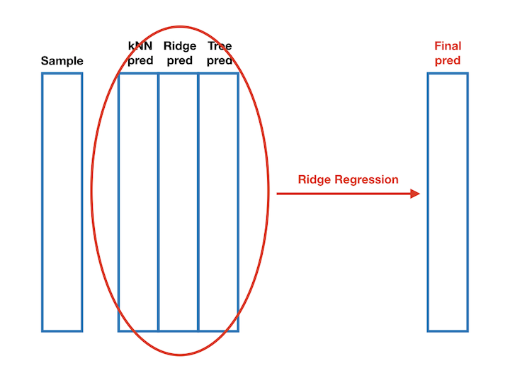

```{r lib,include=FALSE}
library(rJava)
library(RWeka)
library(flexdashboard)
library(shiny)
library(rmarkdown)
library(knitr)
library(Hmisc)
library(DT)
library(data.table)
library(dplyr)
library(FSelector)
library(kknn)
library(caret)
library(plyr)
library(recharts)
library(glmnet)
library(C50)

assignInNamespace(x = "cedta.override", value = c(data.table:::cedta.override,"rmarkdown"), ns = "data.table")
opts_chunk$set(echo = FALSE, comment="", warning = FALSE, message = FALSE, tidy.opts=list(width.cutoff=55), tidy = TRUE)
knitr::opts_chunk$set(echo = FALSE)

```


## Contents 

<div class="blue">
- **<font size="6">Introduction</font>**
</div>

<div class="blue">
- **<font size="6">Exploratory Data Analysis</font>**
</div>

<div class="blue">
- **<font size="6">Methodology</font>**
</div>

<div class="blue">
- **<font size="6">Results</font>**
</div>

<div class="blue">
- **<font size="6">Conclusion & Discussion</font>**
</div>

<div class="blue">
- **<font size="6">Autism Screening App</font>**
</div>

## Introduction 
1. **Autism Spectrum Disorder (ASD): a neurodevelopment disorder associated with limitations in social interactions, communication, and behavior.**

2. **ASD is becoming increasingly common in many parts of the world and is one of the fastest growing developmental disability diagnosis.**

3. **ASD is primarily diagnosed using variables related to behavior, such as social interaction, play and imagination, repetitive behaviors, and communication among others.**

4. **Existing estimates reveal that about 1.5% of the world’s population is on the spectrum, and it is believed that a huge number of individuals on the spectrum remain undetected.**


## Our goal

-- **Clinical Judgement** $\ \ $   😭

-- **Autism Quotient (AQ-50)**  $\ \ $  ☹️

-- **AQ-10**  $\ \ $  🤔

-- **AQ-6**  $\ \ $  😁

-- **Accuracy & Sensitivity**


## Autism Data
```{r description of data}
description <- data.table(
  Feature = c("Age","Gender","Ethnicity","Born with jaundice","CouFamily member with PDD","ntry of residence","Used the screening app before","A1: Question 1 Answer","~A10: Question 10 Answer","Class/ASD"),
  Type = c("Number","String","String","Boolean (yes or no)","StrBoolean (yes or no)","ing","Boolean (yes or no)","Binary (0, 1)","Binary (0, 1)","Boolean (YES or NO)")
)
datatable(description)
```


## Exploratory Data Analysis:


## Methodology

- **Feature Selection**
    + **Chi-Square**
    + **Information Gain**
    + **OneR**
    + **Relief**
  
  
- **Predictive Model**
    + **Ensemble Model**
    + **kNN**
    + **Ridge regression**
    + **Decision Tree**

## Chi-Square
CHI-SQ computes the correlation between variable-class (v,l) using their expected and observed probabilities in the training dataset.

$$C H I-S Q(v_a, l)=\frac{S \times(A D-B C)}{(A+C) \times(B+D) \times(A+B) \times(C+D)}$$

```{r chi_square_table}
chi.sq.table=data.table(c("A","C"),c("B","D"))
colnames(chi.sq.table)=c("Autism","No Autism")
rownames(chi.sq.table)=c("V_a", "Not V_a")
datatable(chi.sq.table)
```

## Information Gain
IG calculates the importance of a variable using the entropy of the class with and without the presence of a variable.

$$G\left(l, v_{a}\right)=Entropy(l)-Entropy(l|v_a)$$
$$=-\sum_{l \in L} \mathrm{p}(l) \log \mathrm{p}(l)+p\left(v_{a}\right) \sum_{l \in L} p\left(l | v_{a}\right) \log p\left(l | v_{a}\right)$$

## OneR
OneR is short for One Rule. It generates one rule for each predictor in the data, then calculate the total error to rank each feature, the lower, the more important.


<div class="columns-2">


</div>

<div class="blue">
<font size="2">Reference from http://www.saedsayad.com/oner.htm </font>
</div>


## Relief

-- **Hypothesis Margin**

-- **Neareast Neighbors**

-- **nearHit, nearMiss**

$$W_{i}=W_{i}-\left(x_{i}-\text {nearHit}_{i}\right)^{2}+\left(x_{i}-\text {nearMiss}_{i}\right)^{2}$$

## Ensemble Model
<center>



</center>


## kNN
This is a weighted kNN method. We use kernel to weight the nearest neighbors, the closer, the higher the weight.


<center>


</center>


## Ridge Regression
$$\sum_{i=1}^{n}\left(y_{i}-\mathbf{z}_{i}^{\top} \boldsymbol{\beta}\right)^{2}+\lambda \sum_{j=1}^{p} \beta_{j}^{2}$$


## Decision Tree

## Results

- **Child & Adolescent**
    + **kNN**
    + **Ridge**
    + **Decision Tree**
    + **Ensemble Model**
  
  
- **Adults**
    + **kNN**
    + **Ridge**
    + **Decision Tree**
    + **Ensemble Model**


## kNN children & adolescents


## Ridge children & adolescents


## Tree children & adolescents

## Ensemble children & adolescents


## kNN adult

## Ridge adult

## Tree adult

## Ensemble adult


## Conclusion & Discussion
1. **Feature selection**
2. **Relative better method: Relief**
3. **Ensemble model does improve the performance**
4. **Size of dataset & Imbalance data**


