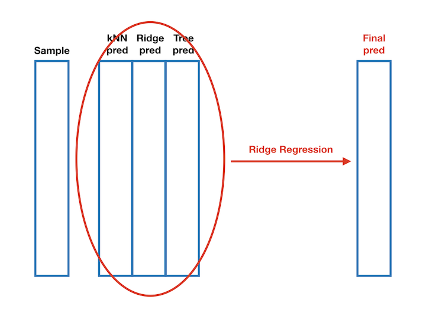
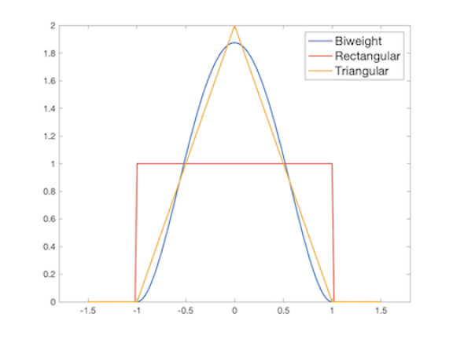

```{r setup, include=FALSE}
library(rJava)
library(RWeka)
library(flexdashboard)
library(shiny)
library(rmarkdown)
library(knitr)
library(Hmisc)
library(DT)
library(data.table) 
library(dplyr)
library(FSelector)
library(kknn)
library(caret)
library(plyr)
library(recharts)
library(glmnet)
library(C50)

assignInNamespace(x = "cedta.override", value = c(data.table:::cedta.override,"rmarkdown"), ns = "data.table")
opts_chunk$set(echo = FALSE, comment="", warning = FALSE, message = FALSE, tidy.opts=list(width.cutoff=55), tidy = TRUE)
knitr::opts_chunk$set(echo = FALSE)
```
```{r functions}
check.frequency <- function(data){
  col.num <- length(names(data))
  for ( i in 1: col.num){
  print(data[,.N,by=eval(names(data)[i])])
  }
}

## function used to compare within groups for each category in each column:
prop.compare <- function(data,c,category){
  if (data[(`Class/ASD` == "YES"& get(c) == category),.N] <= 10 | data[(`Class/ASD` == "NO" & get(c) == category),.N] <= 10 | length(data[`Class/ASD` == "YES", get(c)])-data[(`Class/ASD` == "YES"& get(c) == category),.N] <= 10 | length(data[`Class/ASD` == "NO", get(c)])-data[(`Class/ASD` == "NO"& get(c) == category),.N] <= 10) {
    fisher.test(
      matrix(
      c(data[(`Class/ASD` == "YES"& get(c) == category),.N],
        length(data[`Class/ASD` == "YES", get(c)])-data[(`Class/ASD` == "YES"& get(c) == category),.N],
        data[(`Class/ASD` == "NO" & (get(c)) == category),.N],
        length(data[`Class/ASD` == "NO", get(c)])-data[(`Class/ASD` == "NO"& get(c) == category),.N]),ncol =
        2)
      )$p.value
} else {
    prop.test(x = c(data[(`Class/ASD` == "YES"&get(c) == category),.N],data[(`Class/ASD` == "NO"&get(c) == category),.N]), n = c(length(data[`Class/ASD` == "YES", get(c)]),length(data[`Class/ASD` == "NO", get(c)])))$p.value
  }
}

nprop.compare <- function(data,c,category){
  if (data[(`Class/ASD` == "YES"& get(c) == category),.N] <= 10 | data[(`Class/ASD`== "NO" & get(c) == category),.N] <= 10 | length(data[`Class/ASD` == "YES", get(c)])-data[(`Class/ASD` == "YES"& get(c) == category),.N] <= 10 | length(data[`Class/ASD` == "NO", get(c)])-data[(`Class/ASD` == "NO"& get(c) == category),.N] <= 10) {
    fisher.test(
      matrix(
      c(data[(`Class/ASD` == "YES"& get(c) == category),.N],
        length(data[`Class/ASD` == "YES", get(c)])-data[(`Class/ASD` == "YES"& get(c) == category),.N],
        data[(`Class/ASD` == "NO" & (get(c)) == category),.N],
        length(data[`Class/ASD` == "NO", get(c)])-data[(`Class/ASD` == "NO"& get(c) == category),.N]),ncol =
        2)
      )
} else {
    prop.test(x = c(data[(`Class/ASD` == "YES"&get(c) == category),.N],data[(`Class/ASD`== "NO"&get(c) == category),.N]), n = c(length(data[`Class/ASD` == "YES", get(c)]),length(data[`Class/ASD` == "NO", get(c)])))
  }
}

## function used to compare within one group for all the categories in each column
test.all.prop <- function(data,c){
  common.category <- intersect(unique(data[`Class/ASD` == "YES",get(c)]),unique(data[`Class/ASD` == "NO", get(c)]))
  if (length(common.category) > 1){
   cate <- rep(0, length(common.category))
  names(cate) <- common.category
  for(i in 1:length(common.category)){
  cate[i] <- prop.compare(data,c, common.category[i])
  }
  print(cate)
  print(which(cate < 0.05)) 
  }else{
    prop.compare(data,c,common.category)
  }
}

## function used to compare patients between 3 groups for each category in the each column:
prop.group.comp <- function(data1,data2,data3, c,category){
  if (data1[(`Class/ASD` == "YES" & get(c) == category),.N] <= 10 | 
      data2[(`Class/ASD` == "YES" & get(c) == category),.N] <= 10 | 
      data3[(`Class/ASD` == "YES" & get(c) == category),.N] <= 10 |
      length(data1[`Class/ASD` == "YES", get(c)])-data1[(`Class/ASD` == "YES" & get(c) == category),.N] <= 10 |
      length(data2[`Class/ASD`== "YES", get(c)])-data2[(`Class/ASD` == "YES" & get(c) == category),.N] <= 10 |
      length(data3[`Class/ASD` == "YES", get(c)])-data3[(`Class/ASD` == "YES" & get(c) == category),.N] <=10)
    {
    fisher.test(
      matrix(
      c(data1[(`Class/ASD` == "YES" & get(c) == category),.N],
        length(data1[`Class/ASD` == "YES", get(c)]) - data1[(`Class/ASD` == "YES"& get(c) == category),.N],
        data2[(`Class/ASD` == "YES" & get(c) == category),.N],
        length(data2[`Class/ASD` == "YES", get(c)]) - data2[(`Class/ASD` == "YES"& get(c) == category),.N],
        data3[(`Class/ASD` == "YES" & get(c) == category),.N],
        length(data3[`Class/ASD` == "YES", get(c)]) - data3[(`Class/ASD` == "YES"& get(c) == category),.N]),
       ncol = 2))$p.value
} else {
    prop.test(x = c(data1[(`Class/ASD` == "YES" & get(c) == category),.N],
                    data2[(`Class/ASD` == "YES" & get(c) == category),.N], 
                    data3[(`Class/ASD` == "YES" & get(c) == category),.N]),
              n = c(length(data1[`Class/ASD` == "YES", get(c)]),
                    length(data2[`Class/ASD` == "YES", get(c)]),
                    length(data3[`Class/ASD`== "YES", get(c)])))$p.value
  }
}
 
nprop.group.comp <- function(data1,data2,data3, c,category){
  if (data1[(`Class/ASD`== "YES" & get(c) == category),.N] <= 10 | 
      data2[(`Class/ASD` == "YES" & get(c) == category),.N] <= 10 | 
      data3[(`Class/ASD` == "YES" & get(c) == category),.N] <= 10 |
      length(data1[`Class/ASD` == "YES", get(c)])-data1[(`Class/ASD` == "YES" & get(c) == category),.N] <= 10 |
      length(data2[`Class/ASD` == "YES", get(c)])-data2[(`Class/ASD` == "YES" & get(c) == category),.N] <= 10 |
      length(data3[`Class/ASD` == "YES", get(c)])-data3[(`Class/ASD` == "YES" & get(c) == category),.N] <=10)
    {
    fisher.test(
      matrix(
      c(data1[(`Class/ASD` == "YES" & get(c) == category),.N],
        length(data1[`Class/ASD` == "YES", get(c)]) - data1[(`Class/ASD` == "YES"& get(c) == category),.N],
        data2[(`Class/ASD` == "YES" & get(c) == category),.N],
        length(data2[`Class/ASD` == "YES", get(c)]) - data2[(`Class/ASD` == "YES"& get(c) == category),.N],
        data3[(`Class/ASD` == "YES" & get(c) == category),.N],
        length(data3[`Class/ASD` == "YES", get(c)]) - data3[(`Class/ASD` == "YES"& get(c) == category),.N]),
       ncol = 2))
} else {
    prop.test(x = c(data1[(`Class/ASD` == "YES" & get(c) == category),.N],
                    data2[(`Class/ASD` == "YES" & get(c) == category),.N], 
                    data3[(`Class/ASD` == "YES" & get(c) == category),.N]),
              n = c(length(data1[`Class/ASD` == "YES", get(c)]),
                    length(data2[`Class/ASD` == "YES", get(c)]),
                    length(data3[`Class/ASD` == "YES", get(c)])))
  }
}


## function used to compare all patients between 3 groups for all categories in each column:
test.all.group.prop <- function(data1, data2, data3,c){
  common.category <- intersect(
    intersect(
      unique(data1[`Class/ASD` == "YES",get(c)]),unique(data2[`Class/ASD` == "YES", get(c)])),
    unique(data3[`Class/ASD` == "YES", get(c)]))
  if (length(common.category) > 1){
    cate <- rep(0, length(common.category))
    names(cate) <- common.category
    for(i in 1:length(common.category)){
      cate[i] <- prop.group.comp(data1,data2,data3,c, common.category[i])
  }
    print(cate)
    print(which(cate < 0.05)) 
  }else{
    prop.group.comp(data1,data2,data3,c,common.category)
  }
} 
  
## function used to compare patients between 2 groups for each category in the each column:
prop.2group.comp <- function(data1,data2,c,category){
  if (data1[(`Class/ASD` == "YES" & get(c) == category),.N] <= 10 | 
      data2[(`Class/ASD` == "YES" & get(c) == category),.N] <= 10 | 
      length(data1[`Class/ASD` == "YES", get(c)])-data1[(`Class/ASD` == "YES" & get(c) == category),.N] <= 10 |
      length(data2[`Class/ASD` == "YES", get(c)])-data2[(`Class/ASD` == "YES" & get(c) == category),.N] <= 10)
    {
    fisher.test(
      matrix(
      c(data1[(`Class/ASD` == "YES" & get(c) == category),.N],
        length(data1[`Class/ASD` == "YES", get(c)]) - data1[(`Class/ASD` == "YES"& get(c) == category),.N],
        data2[(`Class/ASD` == "YES" & get(c) == category),.N],
        length(data2[`Class/ASD` == "YES", get(c)]) - data2[(`Class/ASD` == "YES"& get(c) == category),.N]),
       ncol = 2))$p.value
} else {
    prop.test(x = c(data1[(`Class/ASD` == "YES" & get(c) == category),.N],
                    data2[(`Class/ASD` == "YES" & get(c) == category),.N]),
              n = c(length(data1[`Class/ASD` == "YES", get(c)]),
                    length(data2[`Class/ASD` == "YES", get(c)])))$p.value
  }
}

## function used to compare all patients between 2 groups for all categories in each column:
test.all.2group.prop <- function(data1, data2,c){
  common.category <- intersect(unique(data1[`Class/ASD` == "YES",get(c)]),unique(data2[`Class/ASD` == "YES", get(c)]))
  if (length(common.category) > 1){
    cate <- rep(0, length(common.category))
    names(cate) <- common.category
    for(i in 1:length(common.category)){
      cate[i] <- prop.2group.comp(data1,data2,c, common.category[i])
  }
    print(cate)
    print(which(cate < 0.05)) 
  }else{
    prop.2group.comp(data1,data2,c,common.category)
  }
} 

percentage.table <- function(x, digits = 1){
  tab <- table(x)
  percentage.tab <- 100*tab/(sum(tab))
  rounded.tab <- round(x = percentage.tab, digits = digits)
  return(rounded.tab)
}

round.numerics <- function(x, digits){
  if(is.numeric(x)){
    x <- round(x = x, digits = digits)
  }
  return(x)
}
display.frequency <- function(data, index){
  return(data[,.N,by=index])
}

imputation.age.ethnicity <- function(dat.input, imput.names, seed=2019){
  dat=copy(dat.input)
  for (i in 1:length(imput.names)){
    candidate=dat[!is.na(get(imput.names[i])),unique(get(imput.names[i]))]
    num.imput=dat[is.na(get(imput.names[i])),.N]
    set.seed(seed = seed)
    dat[is.na(get(imput.names[i])), eval(imput.names[i]):=sample(candidate,num.imput,replace = T)]
  }
  return(dat)
}

formula.eliminate.fold.class <- function(outcome.name, input.names){
  input.names.delineated=setdiff(input.names,c("fold","Class/ASD","order.index"))
  the.formula <- sprintf("`%s` ~ %s", outcome.name, paste(input.names.delineated, collapse = "+"))
  
  return(as.formula(the.formula))
}

knn.fit <- function(dat, kernel="triangular", k=6, outcome.name="Class/ASD", input.names, seed=2019){
  set.seed(seed = seed)
  folds <- createFolds(y = dat$`Class/ASD`, k = 10, list = F)
  dat$fold = folds
  acc=rep(0,10)
  sensitivity=rep(0,10)
  all.pred=c()
  order.index=c()

  the.formula=formula.eliminate.fold.class(outcome.name, input.names)
  
  for(i in 1:10){
    test.mask=which(dat$fold==i)
    adult.test=dat[test.mask,]
    adult.train=dat[-test.mask,]
    
    knn.fit=kknn(the.formula, adult.train, test=adult.test, 
                 kernel=kernel, k=k)
    knn.pred=fitted(knn.fit)
    metrics=confusionMatrix(knn.pred, adult.test$`Class/ASD`)
    acc[i]=metrics[["overall"]][["Accuracy"]]
    # sensitivity[i]=metrics[["byClass"]][["Sensitivity"]]
    sensitivity[i]=metrics[["table"]][4]/(metrics[["table"]][3]+metrics[["table"]][4])
    all.pred=c(all.pred,knn.pred) # Will conver to number. If levels are "YES","NO -> 1,2
    order.index=c(order.index,test.mask)
  }
  all.pred=as.factor(all.pred)
  levels(all.pred)<-c("NO","YES")
  predictions=cbind.data.frame(order.index, all.pred)
  list_data=list(acc,sensitivity,predictions)
  names(list_data) <- c("Accuracy","Sensitivity","Predictions")
  return(list_data)
}

Ridge.fit<-function(dat,outcome.name="Class/ASD",input.names,seed=2019){
  set.seed(seed)
  folds <- createFolds(y = dat$`Class/ASD`, k = 10, list = F)
  dat$fold<-folds
  acc=rep(0,10)
  sensitivity=rep(0,10)
  all.pred=c()
  order.index=c()
  
  for(i in 1:10){
    test.mask=which(dat$fold==i)
    adult.test=dat[test.mask,]
    adult.train=dat[-test.mask,]
    if (ncol(dat)<7){
      select.col=setdiff(input.names,c("fold","Class/ASD","order.index"))
      adult.train1<-adult.train[,select.col]
      adult.test1<-adult.test[,select.col]
      } else {
        adult.train1<-adult.train[,-c(18,19)]
        adult.test1<-adult.test[,-c(18,19)]
        adult.train1<-subset(adult.train1,select =input.names)
        adult.test1<-subset(adult.test1,select =input.names)}
    traindf<-as.matrix(as.data.frame(lapply(adult.train1, as.numeric)))
    testdf<-as.matrix(as.data.frame(lapply(adult.test1, as.numeric)))
    mod.cv<-cv.glmnet(x = traindf, y = adult.train$`Class/ASD`, family = "binomial",alpha =0)
    pred <- predict(object = mod.cv, newx =testdf, type = "class", s = mod.cv$lambda.min) 
    pred=factor(pred, levels=c("NO","YES"))
    metrics=confusionMatrix(pred, adult.test$`Class/ASD`)
    acc[i]=metrics[["overall"]][["Accuracy"]]
    sensitivity[i]=metrics[["table"]][4]/(metrics[["table"]][3]+metrics[["table"]][4])
    all.pred=c(all.pred,pred)
    order.index=c(order.index,test.mask)
  }
  all.pred=as.factor(all.pred)
  levels(all.pred)<-c("NO","YES")
  predictions=cbind.data.frame(order.index, all.pred)
  list_data=list(acc,sensitivity,predictions)
  names(list_data) <- c("Accuracy","Sensitivity","Predictions")
  return(list_data)
}

Decisiontree.fit<-function(dat,outcome.name="Class/ASD",input.names,seed=2019){
  set.seed(seed)
  folds <- createFolds(y = dat$`Class/ASD`, k = 10, list = F)
  dat$fold<-folds
  acc=rep(0,10)
  sensitivity=rep(0,10)
  all.pred=c()
  order.index=c()
  for(i in 1:10){
    test.mask=which(dat$fold==i)
    adult.test=dat[test.mask,]
    adult.train=dat[-test.mask,]
    if (ncol(dat)<7){
      select.col=setdiff(input.names,c("fold","Class/ASD","order.index"))
      adult.train1<-adult.train[,select.col]
      adult.test1<-adult.test[,select.col]
      } else {
        adult.train1<-adult.train[,-c(18,19)]
        adult.test1<-adult.test[,-c(18,19)]
        adult.train1<-subset(adult.train1,select =input.names)
        adult.test1<-subset(adult.test1,select =input.names)}
    mytree<-C5.0(x=adult.train1,y=adult.train$`Class/ASD`)
    pred<-predict(object =mytree,newdata = adult.test1)
    metrics=confusionMatrix(pred, adult.test$`Class/ASD`)
    acc[i]=metrics[["overall"]][["Accuracy"]]
    sensitivity[i]=metrics[["table"]][4]/(metrics[["table"]][3]+metrics[["table"]][4])
    all.pred=c(all.pred,pred)
    order.index=c(order.index,test.mask)
  }
  all.pred=as.factor(all.pred)
  levels(all.pred)<-c("NO","YES")
  predictions=cbind.data.frame(order.index, all.pred)
  list_data=list(acc,sensitivity,predictions)
  names(list_data) <- c("Accuracy","Sensitivity","Predictions")
  return(list_data)
}


chi.square.feat.selec <- function(dat,the.formula,cutoff.perc=0.5){
  chi.sq.weights <- FSelector::chi.squared(the.formula, dat) # setorder(adult.weights.chi.sq)
  chi.square.vars=cutoff.k.percent(chi.sq.weights, cutoff.perc)
  return(chi.square.vars)
}

ig.feat.selec <- function(dat,the.formula,cutoff.perc=0.5){
  ig.weights <- FSelector::information.gain(the.formula, dat, unit = "log2")
  ig.vars=cutoff.k.percent(ig.weights, cutoff.perc)
  return(ig.vars)
}

oneR.feat.selec <- function(dat,the.formula,cutoff.perc=0.5){
  oneR.weights <- FSelector::oneR(the.formula, dat)
  oneR.vars=cutoff.k.percent(oneR.weights, cutoff.perc)
  return(oneR.vars)
}

relief.feat.selec <- function(dat,the.formula,cutoff.perc=0.5,neighbours.count=5,sample.size=10){
  relief.weights <- FSelector::relief(the.formula, dat, neighbours.count = neighbours.count, sample.size = sample.size)
  relief.vars=cutoff.k.percent(relief.weights, cutoff.perc)
  return(relief.vars)
}

combine.feat.selec <- function(cutoff.perc=0.5,feature.selected){
  feature.selected.count=plyr::count(feature.selected)
  setorderv(feature.selected.count, cols = "freq", order=-1)
  keep.features=floor(nrow(feature.selected.count)*cutoff.perc)
  combined.vars=as.character(feature.selected.count[1:keep.features,]$x)
  return(combined.vars)
}
```

```{r read_data, include=FALSE, eval = T}
dat.autism.child=read.arff("../Autism/Autism-Child-Data.arff")
dat.autism.adolescent=read.arff("../Autism/Autism-Adolescent-Data.arff")
dat.autism.adult=read.arff("../Autism/Autism-Adult-Data.arff")
setDT(dat.autism.child)
setDT(dat.autism.adolescent)
setDT(dat.autism.adult)
```

```{r clean_data}
# clean three useless columns
dat.autism.child[,c("result","age_desc","relation"):=list(NULL,NULL,NULL)]
dat.autism.adolescent[,c("result","age_desc","relation"):=list(NULL,NULL,NULL)]
dat.autism.adult[,c("result","age_desc","relation"):=list(NULL,NULL,NULL)]
# check if any NAs
#dat.autism.child[,lapply(.SD, FUN = function(x){return(sum(is.na(x)))})]
#dat.autism.adolescent[,lapply(.SD, FUN = function(x){return(sum(is.na(x)))})]
#dat.autism.adult[,lapply(.SD, FUN = function(x){return(sum(is.na(x)))})]
# check if any strange value. We found one age in adult has 383
w.383=which(dat.autism.adult[,age]==383)
dat.autism.adult=dat.autism.adult[-w.383,]
# imputation
dat.child.imput=imputation.age.ethnicity(dat.autism.child, imput.names = c("age","ethnicity"))
dat.adolescent.imput=imputation.age.ethnicity(dat.autism.adolescent, imput.names = c("ethnicity"))
dat.adult.imput=imputation.age.ethnicity(dat.autism.adult, imput.names = c("age","ethnicity"))
# change "others" to "Others" in Adult dataset
dat.adult.imput[ethnicity=="others", ethnicity:="Others"]
# combine "child" and "adolescent" group
dat.child.adolescent.combine=rbind(dat.child.imput,dat.adolescent.imput)
# change "U.S. Outlying Islands" to "US Outlying Islands"
w=which(dat.child.adolescent.combine$contry_of_res=="U.S. Outlying Islands")
dat.child.adolescent.combine[w, eval("contry_of_res"):="US Outlying Islands"]
new.lev=c(setdiff(levels(dat.child.adolescent.combine$contry_of_res),"U.S. Outlying Islands"),"US Outlying Islands")
levels(dat.child.adolescent.combine$contry_of_res) <- new.lev
```
```{r constants}
id.name <- "id"
A1_Score.name <- "A1_Score"    
A2_Score.name <- "A2_Score"
A3_Score.name <- "A3_Score"
A4_Score.name <- "A4_Score"
A5_Score.name <- "A5_Score"
A6_Score.name <- "A6_Score"
A7_Score.name <- "A7_Score"
A8_Score.name <- "A8_Score"
A9_Score.name <- "A9_Score"
A10_Score.name <- "A10_Score"
age.name <- "age"
gender.name <- "gender"
ethnicity.name <- "ethnicity"
jundice.name <- "jundice"
austim.name <- "austim" 
contry_of_res.name <- "contry_of_res"  
used_app_before.name <- "used_app_before"
Class.ASD.name <- "Class/ASD"
```
```{r Child-EDA}
#wilcox.test(as.numeric(dat.child.imput[`Class/ASD` =="YES",]$age),as.numeric(dat.child.imput[`Class/ASD` == "NO",]$age))
# Conclusion: Since the p-value is greater than 0.05, we fail to reject the null hypothesis and conclude that these two samples are not significantly different at 5% significance level. 
d1 <- data.table(Subject = "mean.age",
                 Patients = round(mean(as.numeric(dat.child.imput[`Class/ASD` == "YES",]$age),na.rm = TRUE),2),
                 Non.patients = round(mean(as.numeric(dat.child.imput[`Class/ASD` == "NO",]$age),na.rm = TRUE),2),
                 P.value = 0.4394)

## gender (same)
# test.all.prop(dat.child.imput,"gender")
# nprop.compare(dat.child.imput,"gender","m")
# dat.child.imput[`Class/ASD` == "YES",.N, keyby = "gender"]
# dat.child.imput[`Class/ASD` == "NO",.N, keyby = "gender"]
# dat.adult.imput[`Class/ASD` == "NO",.N, keyby = "gender"]
# Conclusion: There is no difference between chidren with austim and without austim in terms of gender. 
d2 <- data.table(Subject = "percentage of male",
                 Patients = paste(round(100*105/(105+46),2),"%",sep=""),
                 Non.patients = paste(round(100*103/(103+38),2),"%",sep=""),
                 P.value = 0.5938)
## ethnicity (White-European, Middle Eastern different)
#test.all.prop(dat.child.imput,"ethnicity")
cp.eth <- dat.child.imput[`Class/ASD` == "YES",.N,keyby = "ethnicity"]
cp.eth$percent <- round(100*cp.eth[,2]/sum(cp.eth$N),2)
cp.eth$percent <- paste(cp.eth$percent,"%",sep="")

cn.eth <- dat.child.imput[`Class/ASD` == "NO",.N,keyby = "ethnicity"]
cn.eth$percent <- round(100*cn.eth[,2]/sum(cn.eth$N),2)
cn.eth$percent <- paste(cn.eth$percent,"%",sep="")

d3 <- data.table(Subject = dat.child.imput[`Class/ASD` == "YES",.N,keyby = "ethnicity"]$ethnicity,
                 Patients = cp.eth$percent,
                 Non.patients = cn.eth$percent,
                 P.value = c(0.6694,0.0233, 0.0121,0.8043,0.2161, 0.9190,0.7511,1.0000,0.3722,1.0000))
# Conclusion: The p-values for White-Eurpoean and  Middle Eastern are less than 0.05, so we reject the null hypothesis and conclude that the percentages of White-Eurpoean and Middle Eastern  are different in two groups. #Especially, the children with austim have a higher percentage of  White-Eurpoean than the children without austim. 

## jundice
#test.all.prop(dat.child.imput,"jundice")
# Conlusion: There is no difference between children with austim and chldren without austim in terms of jundice. 
cp.jun <- dat.child.imput[`Class/ASD` == "YES",.N,keyby = "jundice"]
cp.jun$percent <- round(100*cp.jun[,2]/sum(cp.jun$N),2)
cp.jun$percent <- paste(cp.jun$percent,"%",sep = "")
cn.jun <- dat.child.imput[`Class/ASD` == "NO",.N,keyby = "jundice"]
cn.jun$percent <- round(100*cn.jun[,2]/sum(cn.jun$N),2)
cn.jun$percent <- paste(cn.jun$percent,"%",sep = "")
d4 <- data.table(Subject = "percent of jaundice = yes",
                 Patients = cp.jun$percent[2],
                 Non.patients = cn.jun$percent[2],
                 P.value = 0.7667)

## contry_of_res (United States and Jordan)
#test.all.prop(dat.child.imput,"contry_of_res")
cp.con <- dat.child.imput[`Class/ASD` == "YES",.N,keyby = "contry_of_res"]
cp.con$percent <- round(100*cp.con[,2]/sum(cp.con$N),2)
cp.con$percent <- paste(cp.con$percent,"%",sep = "")
cp.con.common = cp.con[contry_of_res %in% c(intersect(dat.child.imput[`Class/ASD` == "YES",]$contry_of_res,dat.child.imput[`Class/ASD` == "NO",]$contry_of_res)),]

cn.con <- dat.child.imput[`Class/ASD` == "NO",.N,keyby = "contry_of_res"]
cn.con$percent <- round(100*cn.con[,2]/sum(cn.con$N),2)
cn.con$percent <- paste(cn.con$percent,"%",sep = "")
cn.con.common <- cn.con[contry_of_res %in% c(intersect(dat.child.imput[`Class/ASD` == "YES",]$contry_of_res,dat.child.imput[`Class/ASD` == "NO",]$contry_of_res)),]

d5 <- data.table(
  subject = cp.con.common$contry_of_res,
  Patients = cp.con.common$percent,
  Non.patients = cn.con.common$percent,
  P.value = c(0.0369,0.0006,0.3220,1.0000,1.0000, 0.3534,1.0000,0.5753,1.0000,1.0000,0.6233,1.0000, 0.2686,0.3560,0.6854,1.0000,0.6112,1.0000,1.0000)
  )
  
# Conlusion: There is no difference between children with austim and children without austim in terms of contry_of_res except for Jordan and United States. And the children with austim have a higher percentage of people whose country of residence is United kingdom than the children without austim.

## used_app_before
#test.all.prop(dat.child.imput,"used_app_before")
# Conlusion: There is no difference between children with austim and children without austim in terms of used_app_before. 
cp.use <- dat.child.imput[`Class/ASD` == "YES",.N,keyby = "used_app_before"]
cp.use$percent <- round(100*cp.use[,2]/sum(cp.use$N),2)
cp.use$percent <- paste(cp.use$percent, "%", sep = "")
cn.use <- dat.child.imput[`Class/ASD` == "NO",.N,keyby = "used_app_before"]
cn.use$percent <- round(100*cn.use[,2]/sum(cn.use$N),2)
cn.use$percent <- paste(cn.use$percent,"%",sep = "")
d6 <- data.table(Subject = "percent of used_app_before = yes",
                 Patients = cp.use$percent[2],
                 Non.patients = cn.use$percent[2],
                 P.value = 0.5437)

## austim
#test.all.prop(dat.child.imput,"austim")
# Conlusion: There is no difference between children with austim and children without austim in terms of whether any immediate family member has a PDD. 

cp.pdd <- dat.child.imput[`Class/ASD` == "YES",.N,keyby = "austim"]
cp.pdd$percent <- round(100*cp.pdd[,2]/sum(cp.pdd$N),2)
cp.pdd$percent <- paste(cp.pdd$percent,"%",sep = "")
cn.pdd <- dat.child.imput[`Class/ASD` == "NO",.N,keyby = "austim"]
cn.pdd$percent <- round(100*cn.pdd[,2]/sum(cn.pdd$N),2)
cn.pdd$percent <- paste(cn.pdd$percent,"%",sep = "")
d7 <- data.table(Subject = "percent of family-member pdd = yes",
                 Patients = cp.pdd$percent[2],
                 Non.patients = cn.pdd$percent[2],
                 P.value = 0.4983)
```
```{r Adolescent-EDA}
## age (same)
# First, check the whether the distribution of age of adolescent with austim and the distrbution of age of adolescent without austim are normal. 
#shapiro.test(x = as.numeric(dat.adolescent.imput[`Class/ASD` == "YES",]$age)) # p-value <0.05, check normality:  not normal
#shapiro.test(x = as.numeric(dat.adolescent.imput[`Class/ASD` == "NO",]$age)) #  p-value <0.05, check normality: not normal
# Second, we use the Mann-Whitney-Wilcoxon Test to check whether the two distributions are identical. 
#wilcox.test(as.numeric(dat.adolescent.imput[`Class/ASD` == "YES",]$age),as.numeric(dat.adolescent.imput[`Class/ASD` == "NO",]$age))
# Conclusion: Since the p-value is greater than 0.05, we fail to reject the null hypothesis and conclude that the two groups have the same mean age. 
#dat.adolescent.imput[`Class/ASD` =="NO",.(mean.age = mean(as.numeric(age), na.rm = TRUE))]
#dat.adolescent.imput[`Class/ASD` =="YES",.(mean.age = mean(as.numeric(age), na.rm = TRUE))]
# So the adolescents without austim have higher mean age than the adolescents with austim. 
d8 <- data.table(Subject = "mean.age",
                 Patients = round(mean(as.numeric(dat.adolescent.imput[`Class/ASD` == "YES",]$age),na.rm = TRUE),2),
                 Non.patients = round(mean(as.numeric(dat.adolescent.imput[`Class/ASD` == "NO",]$age),na.rm = TRUE),2),
                 P.value =  0.304)

## gender
#test.all.prop(dat.adolescent.imput,"gender")
# Conclusion: There is no difference between adolescents with austim and adolescents without austim in terms of gender. 
#nprop.compare(dat.adolescent.imput,"gender","m")
d9 <- data.table(Subject = "percentage of male",
                 Patients = "56.10%",
                 Non.patients = "42.86%",
                 P.value = 0.2628)
## ethnicity
#test.all.prop(dat.adolescent.imput,"ethnicity")
# Conclusion: There is no difference between adolescents with austim and adolescents without austim in terms of ethnicity. 
adp.eth <- dat.adolescent.imput[`Class/ASD` == "YES",.N,keyby = "ethnicity"]
adp.eth$percent <- round(100*adp.eth[,2]/sum(adp.eth$N),2)
adp.eth$percent <- paste(adp.eth$percent,"%",sep = "")
adn.eth <- dat.adolescent.imput[`Class/ASD` == "NO",.N,keyby = "ethnicity"]
adn.eth$percent <- round(100*adn.eth[,2]/sum(adn.eth$N),2)
adn.eth$percent <- paste(adn.eth$percent,"%",sep = "")

d10 <- data.table(Subject = dat.adolescent.imput[`Class/ASD` == "YES",.N,keyby = "ethnicity"]$ethnicity,
                 Patients = adp.eth$percent,
                 Non.patients = adn.eth$percent,
                 P.value = c(0.1093,0.7091,0.0555,0.3122,0.2976,0.0723,0.6781,0.4090)
)
## jundice(yes)
#test.all.prop(dat.adolescent.imput,"jundice")
# Conlusion: There is no difference between adolescents with austim and chldren without austim in terms of jundice. 
adp.jun <- dat.adolescent.imput[`Class/ASD` == "YES",.N,keyby = "jundice"]
adp.jun$percent <- round(100*adp.jun[,2]/sum(adp.jun$N),2)
adp.jun$percent <- paste(adp.jun$percent,"%",sep = "")
adn.jun <- dat.adolescent.imput[`Class/ASD` == "NO",.N,keyby = "jundice"]
adn.jun$percent <- round(100*adn.jun[,2]/sum(adn.jun$N),2)
adn.jun$percent <- paste(adn.jun$percent,"%",sep = "")
d11 <- data.table(Subject = "percent of jaundice = yes",
                 Patients = adp.jun$percent[1],
                 Non.patients = adn.jun$percent[1],
                 P.value = 0.7834)

## contry_of_res (United Kingdom and United States)
#test.all.prop(dat.adolescent.imput,"contry_of_res")
# Conlusion: There is no difference between adolescents with austim and children without austim in terms of contry_of_res except for United Kingdom and United States.
adp.con <- dat.adolescent.imput[`Class/ASD` == "YES",.N,keyby = "contry_of_res"]
adp.con$percent <- round(100*adp.con[,2]/sum(adp.con$N),2)
adp.con$percent <- paste(adp.con$percent,"%",sep = "")
adp.con.common = adp.con[contry_of_res %in% c(intersect(dat.adolescent.imput[`Class/ASD` == "YES",]$contry_of_res,dat.adolescent.imput[`Class/ASD` == "NO",]$contry_of_res)),]

adn.con <- dat.adolescent.imput[`Class/ASD` == "NO",.N,keyby = "contry_of_res"]
adn.con$percent <- round(100*adn.con[,2]/sum(adn.con$N),2)
adn.con$percent <- paste(adn.con$percent,"%",sep = "")
adn.con.common <- adn.con[contry_of_res %in% c(intersect(dat.adolescent.imput[`Class/ASD` == "YES",]$contry_of_res,dat.adolescent.imput[`Class/ASD` == "NO",]$contry_of_res)),]

d12 <- data.table(
  subject = adp.con.common$contry_of_res,
  Patients = adp.con.common$percent,
  Non.patients = adn.con.common$percent,
  P.value = c(0.3803,0.0242,0.0256,0.3354,1.0000,1.0000,1.0000,0.5603,1.0000,1.0000)
  )

## used_app_before
#test.all.prop(dat.adolescent.imput,"used_app_before")
# Conlusion: There is no difference between adolescent with austim and adolescent without austim in terms of used_app_before. 
adp.use <-  dat.adolescent.imput[`Class/ASD` == "YES",.N,keyby = "used_app_before"]
adp.use$percent <- round(100*adp.use[,2]/sum(adp.use$N),2)
adp.use$percent <- paste(adp.use$percent,"%",sep = "")
adn.use <- dat.adolescent.imput[`Class/ASD` == "NO",.N,keyby = "used_app_before"]
adn.use$percent <- round(100*adn.use[,2]/sum(adn.use$N),2)
adn.use$percent <- paste(adn.use$percent,"%",sep = "")
d13 <- data.table(Subject = "percent of used_app_before = yes",
                 Patients = adp.use$percent[2],
                 Non.patients = adn.use$percent[2],
                 P.value = 0.2976)

## austim
#test.all.prop(dat.adolescent.imput,"austim")
# Conlusion: There is no difference between adolescent with austim and children without austim in terms of whether any immediate family member has a PDD.
adp.pdd <- dat.adolescent.imput[`Class/ASD` == "YES",.N,keyby = "austim"]
adp.pdd$percent <- round(100*adp.pdd[,2]/sum(adp.pdd$N),2)
adp.pdd$percent <- paste(adp.pdd$percent,"%",sep = "")
adn.pdd <- dat.adolescent.imput[`Class/ASD` == "NO",.N,keyby = "austim"]
adn.pdd$percent <- round(100*adn.pdd[,2]/sum(adn.pdd$N),2)
adn.pdd$percent <- paste(adn.pdd$percent,"%",sep = "")
d14 <- data.table(Subject = "percent of family-member pdd = yes",
                 Patients = adp.pdd$percent[1],
                 Non.patients = adn.pdd$percent[1],
                 P.value = 0.7769)
```
```{r Adult-EDA}
## age (different)
# First, check the whether the distribution of age of adolescent with austim and the distrbution of age of adolescent without austim are normal. 
#shapiro.test(x = as.numeric(dat.adult.imput[`Class/ASD` == "YES",]$age)) # p-value < 0.05, check normality: normal
#shapiro.test(x = as.numeric(dat.adult.imput[`Class/ASD` == "NO",]$age)) #  p-value < 0.05, check normality: not normal
# Second, we use the Mann-Whitney-Wilcoxon Test to check whether the two distributions are identical. 
#wilcox.test(as.numeric(dat.adult.imput[`Class/ASD` == "YES",]$age),as.numeric(dat.adult.imput[`Class/ASD` == "NO",]$age))
# Conclusion: Since the p-value is less than 0.05, we reject the null hypothesis and conclude that the two groups have different mean age. 
d15 <- data.table(Subject = "mean.age",
                 Patients = round(mean(as.numeric(dat.adult.imput[`Class/ASD` == "YES",]$age),na.rm = TRUE),2),
                 Non.patients = round(mean(as.numeric(dat.adult.imput[`Class/ASD` == "NO",]$age),na.rm = TRUE),2),
                 P.value =  0.0012)

## gender (different)
#test.all.prop(dat.adult.imput,"gender")
# Conclusion: There exists difference between adolescents with austim and adolescents without austim in terms of gender. 
#dat.adult.imput[`Class/ASD` == "YES",.N, keyby = "gender"]
#dat.adult.imput[`Class/ASD` == "NO",.N, keyby = "gender"]
d16 <- data.table(Subject = "percentage of male",
                 Patients = paste(round(100*281/(281+233),2),"%",sep = ""),
                 Non.patients = paste(round(100*86/(86+103),2),"%",sep = ""),
                 P.value = 0.0383)
# Conclusion: So the adults with austim have a higher percent of males than the adults without austim. 

## ethnicity(Asian, White-European, Middle Easter and South Asian )
#test.all.prop(dat.adult.imput,"ethnicity")
# Conclusion: There is no difference between adults with austim and adults without austim in terms of ethnicity except for White-European,Middle Eastern,South Asian and Asian.   
ap.eth <- dat.adult.imput[`Class/ASD` == "YES",.N,keyby = "ethnicity"]
ap.eth$percent <- round(100*ap.eth[,2]/sum(ap.eth$N),2)
ap.eth$percent <- paste(ap.eth$percent,"%","")
an.eth <- dat.adult.imput[`Class/ASD` == "NO",.N,keyby = "ethnicity"]
an.eth$percent <- round(100*an.eth[,2]/sum(an.eth$N),2)
an.eth$percent <- paste(an.eth$percent,"%",sep = "")
d17 <- data.table(Subject = dat.adult.imput[`Class/ASD` == "YES",.N,keyby = "ethnicity"]$ethnicity,
                 Patients = ap.eth$percent,
                 Non.patients = an.eth$percent,
                 P.value = c(0,0.3920,0.1842,0.2526,0.0002,0.1552,0, 0.0069,0.6410,0.4570)
)

## jundice
#test.all.prop(dat.adult.imput,"jundice")
# Conlusion: There exists difference between children with austim and chldren without austim in terms of jundice. 
ap.jun <- dat.adult.imput[`Class/ASD` == "YES",.N,keyby = "jundice"]
ap.jun$percent <- round(100*ap.jun[,2]/sum(ap.jun$N),2)
ap.jun$percent <- paste(ap.jun$percent,"%",sep = "")
an.jun <- dat.adult.imput[`Class/ASD` == "NO",.N,keyby = "jundice"]
an.jun$percent <- round(100*an.jun[,2]/sum(an.jun$N),2)
an.jun$percent <- paste(an.jun$percent,"%",sep = "")
d18 <- data.table(Subject = "percent of jaundice = yes",
                 Patients = ap.jun$percent[2],
                 Non.patients = an.jun$percent[2],
                 P.value = 0.0105)
## contry_of_res
#test.all.prop(dat.adult.imput,"contry_of_res")  
# Conlusion: There is no difference between adults with austim and adults without austim in terms of contry_of_res except for United States,Jordan,Arab Emirates,United Kingdom,Canada,India,Malaysia and Italy. 
ap.con <- dat.adult.imput[`Class/ASD` == "YES",.N,keyby = "contry_of_res"]
ap.con$percent <- round(100*ap.con[,2]/sum(ap.con$N),2)
ap.con$percent <- paste(ap.con$percent,"%","")
ap.con.common = ap.con[contry_of_res %in% c(intersect(dat.adult.imput[`Class/ASD` == "YES",]$contry_of_res,dat.adult.imput[`Class/ASD` == "NO",]$contry_of_res)),]

an.con <- dat.adult.imput[`Class/ASD` == "NO",.N,keyby = "contry_of_res"]
an.con$percent <- round(100*an.con[,2]/sum(an.con$N),2)
an.con$percent <- paste(an.con$percent,"%",sep = "")
an.con.common <- an.con[contry_of_res %in% c(intersect(dat.adult.imput[`Class/ASD` == "YES",]$contry_of_res,dat.adult.imput[`Class/ASD` == "NO",]$contry_of_res)),]

d19 <- data.table(
  subject = ap.con.common$contry_of_res,
  Patients = ap.con.common$percent,
  Non.patients = an.con.common$percent,
  P.value = c(0,0.0639,0.1776, 0.1075, 0.4657,0.0615, 0.4657,0, 0.6149,0,0.5304,0.0336, 0.0201,1,1,0.1764,0.0605,0.0013,1,0.4708,1,0,1,0.2937,0.2208, 0.3935, 0.4657, 0.0201,1)
  )

## used_app_before
#test.all.prop(dat.adult.imput,"used_app_before")
# Conlusion: There is no difference between adults with austim and adults without austim in terms of used_app_before. 
ap.use <-  dat.adult.imput[`Class/ASD` == "YES",.N,keyby = "used_app_before"]
ap.use$percent <- round(100*ap.use[,2]/sum(ap.use$N),2)
ap.use$percent <- paste(ap.use$percent,"%",sep = "")
an.use <- dat.adult.imput[`Class/ASD` == "NO",.N,keyby = "used_app_before"]
an.use$percent <- round(100*an.use[,2]/sum(an.use$N),2)
an.use$percent <- paste(an.use$percent,"%",sep = "")
d20 <- data.table(Subject = "percent of used_app_before = yes",
                 Patients = ap.use$percent[2],
                 Non.patients = an.use$percent[2],
                 P.value = 0.3213)

## austim
#test.all.prop(dat.adult.imput,"austim" )
# Conlusion: There exists difference between adults with austim and adults without austim in terms of whether any immediate family member has a PDD.

ap.pdd <- dat.adult.imput[`Class/ASD` == "YES",.N,keyby = "austim"]
ap.pdd$percent <- round(100*ap.pdd[,2]/sum(ap.pdd$N),2)
ap.pdd$percent <- paste(ap.pdd$percent,"%",sep = "")
an.pdd <- dat.adult.imput[`Class/ASD` == "NO",.N,keyby = "austim"]
an.pdd$percent <- round(100*an.pdd[,2]/sum(an.pdd$N),2)
an.pdd$percent <- paste(an.pdd$percent,"%",sep = "")
d21 <- data.table(Subject = "percent of family-member pdd = yes",
                 Patients = ap.pdd$percent[2],
                 Non.patients = an.pdd$percent[2],
                 P.value = 0)
```

## Contents 


- **<font size="6">Introduction</font>**


- **<font size="6">Exploratory Data Analysis</font>**


- **<font size="6">Methodology</font>**


- **<font size="6">Results</font>**


- **<font size="6">Conclusion & Discussion</font>**


- **<font size="6">Autism Screening App</font>**


## Introduction 
1. **Autism Spectrum Disorder (ASD): a neurodevelopment disorder associated with limitations in social interactions, communication, and behavior.**

2. **ASD is becoming increasingly common in many parts of the world and is one of the fastest growing developmental disability diagnosis.**

3. **ASD is primarily diagnosed using variables related to behavior, such as social interaction, play and imagination, repetitive behaviors, and communication among others.**

4. **Existing estimates reveal that about 1.5% of the world’s population is on the spectrum, and it is believed that a huge number of individuals on the spectrum remain undetected.**


## Our goal

-- **Clinical Judgement** $\ \ $   😭

-- **Autism Quotient (AQ-50)**  $\ \ $  ☹️

-- **AQ-10**  $\ \ $  🤔

-- **AQ-6**  $\ \ $  😁

-- **Accuracy & Sensitivity**


## Autism Data
```{r description of data}
description <- data.table(
  Feature = c("Age","Gender","Ethnicity","Born with jaundice","Family member with PDD","Country of residence","Used the screening app before","A1: Question 1 Answer","~A10: Question 10 Answer","Class/ASD"),
  Type = c("Number","String","String","Boolean (yes or no)","Boolean (yes or no)","String","Boolean (yes or no)","Binary (0, 1)","Binary (0, 1)","Boolean (YES or NO)")
)
datatable(description)
```


## Exploratory Data Analysis:
### Tests

-- **Shapiro–Wilk test**

-- **Wilcoxon signed-rank test**

-- **Chi-squared test**

-- **Fisher's exact test**


***
Age & Gender (Children):There is no significant difference.
```{r children}
datatable(rbind(d1,d2))
```

***
Ethnicity (Children): $\underline{Middle\ Eastern}$ & $\underline{White-European}$
```{r children ethnicity}
datatable(d3)
```


***
Adult: 
```{r adult}
datatable(rbind(d15,d16,d18,d21))
```


```{r feature_selection}
the.formula=formula.eliminate.fold.class("Class/ASD",names(dat.child.adolescent.combine))
child.adolescent.chi.square.vars=chi.square.feat.selec(dat.child.adolescent.combine,the.formula,cutoff.perc=0.5)
child.adolescent.ig.vars=ig.feat.selec(dat.child.adolescent.combine,the.formula,cutoff.perc=0.5)
child.adolescent.oneR.vars=oneR.feat.selec(dat.child.adolescent.combine,the.formula,cutoff.perc=0.5)
child.adolescent.relief.vars=relief.feat.selec(dat.child.adolescent.combine,the.formula,cutoff.perc=0.5, neighbours.count=5, sample.size=10)
child.adolescent.feature.selected=c(child.adolescent.chi.square.vars,
                   child.adolescent.ig.vars,
                   child.adolescent.oneR.vars,
                   child.adolescent.relief.vars)
child.adolescent.combined.vars=combine.feat.selec(cutoff.perc=0.5,child.adolescent.feature.selected)

adult.chi.square.vars=chi.square.feat.selec(dat.adult.imput,the.formula,cutoff.perc=0.5)
adult.ig.vars=ig.feat.selec(dat.adult.imput,the.formula,cutoff.perc=0.5)
adult.oneR.vars=oneR.feat.selec(dat.adult.imput,the.formula,cutoff.perc=0.5)
adult.relief.vars=relief.feat.selec(dat.adult.imput,the.formula,cutoff.perc=0.5, neighbours.count=5, sample.size=10)
adult.feature.selected=c(adult.chi.square.vars,
                   adult.ig.vars,
                   adult.oneR.vars,
                   adult.relief.vars)
adult.combined.vars=combine.feat.selec(cutoff.perc=0.5,adult.feature.selected)

```

```{r kNN_child_adolescent}
# tune parameter
temp=train.kknn(`Class/ASD`~., dat.child.adolescent.combine, kmax=20, distance=2, scale=F, kcv=10,
                kernel = c("rectangular", "triangular", "epanechnikov","biweight","triweight",
                           "gaussian", "rank", "optimal"))
best.kernel=temp$best.parameters$kernel # rectangular
best.k=temp$best.parameters$k # 4

# Original (No feature selection applied)
knn.ori.child.adolescent.results=knn.fit(dat=dat.child.adolescent.combine, 
                      kernel=best.kernel, k=best.k, 
                      outcome.name="Class/ASD", input.names=names(dat.child.adolescent.combine),
                      seed=2019)
# chi-square
knn.chi.square.child.adolescent.results=knn.fit(dat=dat.child.adolescent.combine, 
                      kernel=best.kernel, k=best.k, 
                      outcome.name="Class/ASD", input.names=child.adolescent.chi.square.vars,
                      seed=2019)
# information gain
knn.ig.child.adolescent.results=knn.fit(dat=dat.child.adolescent.combine, 
                      kernel=best.kernel, k=best.k, 
                      outcome.name="Class/ASD", input.names=child.adolescent.ig.vars,
                      seed=2019)
# oneR
knn.oneR.child.adolescent.results=knn.fit(dat=dat.child.adolescent.combine, 
                      kernel=best.kernel, k=best.k, 
                      outcome.name="Class/ASD", input.names=child.adolescent.oneR.vars,
                      seed=2019)
# relief
knn.relief.child.adolescent.results=knn.fit(dat=dat.child.adolescent.combine, 
                      kernel=best.kernel, k=best.k, 
                      outcome.name="Class/ASD", input.names=child.adolescent.relief.vars,
                      seed=2019)
# combined
knn.combine.feat.child.adolescent.results=knn.fit(dat=dat.child.adolescent.combine, 
                      kernel=best.kernel, k=best.k, 
                      outcome.name="Class/ASD", input.names=child.adolescent.combined.vars,
                      seed=2019)
```

```{r ridge_child_adolescent}
# Original (No feature selection applied)
ridge.ori.child.adolescent.results<-Ridge.fit(dat=dat.child.adolescent.combine,input.names=setdiff(names(dat.child.adolescent.combine),c("Class/ASD")),seed=2019)
# chi-square
ridge.chi.square.child.adolescent.results=Ridge.fit(dat=dat.child.adolescent.combine,input.names=child.adolescent.chi.square.vars,seed=2019)
# information gain
ridge.ig.child.adolescent.results=Ridge.fit(dat=dat.child.adolescent.combine,input.names=child.adolescent.ig.vars,seed=2019)
# oneR
ridge.oneR.child.adolescent.results=Ridge.fit(dat=dat.child.adolescent.combine,input.names=child.adolescent.oneR.vars,seed=2019)
# relief
ridge.relief.child.adolescent.results=Ridge.fit(dat=dat.child.adolescent.combine,input.names=child.adolescent.relief.vars,seed=2019)
# combined
ridge.combine.feat.child.adolescent.results=Ridge.fit(dat=dat.child.adolescent.combine,input.names=child.adolescent.combined.vars,seed=2019)
```


```{r decisiontree_child_adolescent}
# Original (No feature selection applied)
tree.ori.child.adolescent.results<-Decisiontree.fit(dat=dat.child.adolescent.combine,input.names=setdiff(names(dat.child.adolescent.combine),c("Class/ASD","fold")),seed=2019)
# chi-square
tree.chi.square.child.adolescent.results=Decisiontree.fit(dat=dat.child.adolescent.combine,input.names=child.adolescent.chi.square.vars,seed=2019)
# information gain
tree.ig.child.adolescent.results=Decisiontree.fit(dat=dat.child.adolescent.combine,input.names=child.adolescent.ig.vars,seed=2019)
# oneR
tree.oneR.child.adolescent.results=Decisiontree.fit(dat=dat.child.adolescent.combine,input.names=child.adolescent.oneR.vars,seed=2019)
# relief
tree.relief.child.adolescent.results=Decisiontree.fit(dat=dat.child.adolescent.combine,input.names=child.adolescent.relief.vars,seed=2019)
# combined
tree.combine.feat.child.adolescent.results=Decisiontree.fit(dat=dat.child.adolescent.combine,input.names=child.adolescent.combined.vars,seed=2019)
```


```{r kNN_adult}
# tune parameter
temp=train.kknn(`Class/ASD`~., dat.adult.imput, kmax=20, distance=2, scale=F, kcv=10,
                kernel = c("rectangular", "triangular", "epanechnikov","biweight","triweight",
                           "gaussian", "rank", "optimal"))
best.kernel=temp$best.parameters$kernel # triangular
best.k=temp$best.parameters$k # 10

# Original (No feature selection applied)
knn.ori.adult.results=knn.fit(dat=dat.adult.imput, 
                      kernel=best.kernel, k=best.k, 
                      outcome.name="Class/ASD", input.names=names(dat.adult.imput),
                      seed=2019)
# chi-square
knn.chi.square.adult.results=knn.fit(dat=dat.adult.imput, 
                      kernel=best.kernel, k=best.k, 
                      outcome.name="Class/ASD", input.names=adult.chi.square.vars,
                      seed=2019)
# information gain
knn.ig.adult.results=knn.fit(dat=dat.adult.imput, 
                      kernel=best.kernel, k=best.k, 
                      outcome.name="Class/ASD", input.names=adult.ig.vars,
                      seed=2019)
# oneR
knn.oneR.adult.results=knn.fit(dat=dat.adult.imput, 
                      kernel=best.kernel, k=best.k, 
                      outcome.name="Class/ASD", input.names=adult.oneR.vars,
                      seed=2019)
# relief
knn.relief.adult.results=knn.fit(dat=dat.adult.imput, 
                      kernel=best.kernel, k=best.k, 
                      outcome.name="Class/ASD", input.names=adult.relief.vars,
                      seed=2019)
# combined
knn.combine.feat.adult.results=knn.fit(dat=dat.adult.imput, 
                      kernel=best.kernel, k=best.k, 
                      outcome.name="Class/ASD", input.names=adult.combined.vars,
                      seed=2019)

```

```{r ridge_adult}
# Original (No feature selection applied)
ridge.ori.adult.results<-Ridge.fit(dat=dat.adult.imput,input.names=setdiff(names(dat.adult.imput),c("Class/ASD","fold")),seed=2019)
# chi-square
ridge.chi.square.adult.results=Ridge.fit(dat=dat.adult.imput,input.names=adult.chi.square.vars,seed=2019)
# information gain
ridge.ig.adult.results=Ridge.fit(dat=dat.adult.imput,input.names=adult.ig.vars,seed=2019)
# oneR
ridge.oneR.adult.results=Ridge.fit(dat=dat.adult.imput,input.names=adult.oneR.vars,seed=2019)
# relief
ridge.relief.adult.results=Ridge.fit(dat=dat.adult.imput,input.names=adult.relief.vars,seed=2019)
# combined
ridge.combine.feat.adult.results=Ridge.fit(dat=dat.adult.imput,input.names=adult.combined.vars,seed=2019)
```

```{r decisiontree_adult}
# Original (No feature selection applied)
tree.ori.adult.results<-Decisiontree.fit(dat=dat.adult.imput,input.names=setdiff(names(dat.adult.imput),c("Class/ASD","fold")),seed=2019)
# chi-square
tree.chi.square.adult.results=Decisiontree.fit(dat=dat.adult.imput,input.names=adult.chi.square.vars,seed=2019)
# information gain
tree.ig.adult.results=Decisiontree.fit(dat=dat.adult.imput,input.names=adult.ig.vars,seed=2019)
# oneR
tree.oneR.adult.results=Decisiontree.fit(dat=dat.adult.imput,input.names=adult.oneR.vars,seed=2019)
# relief
tree.relief.adult.results=Decisiontree.fit(dat=dat.adult.imput,input.names=adult.relief.vars,seed=2019)
# combined
tree.combine.feat.adult.results=Decisiontree.fit(dat=dat.adult.imput,input.names=adult.combined.vars,seed=2019)
```

## Methodology
- **Feature Selection**
    + **Chi-Square**
    + **Information Gain**
    + **OneR**
    + **Relief**
  
  
- **Predictive Model**
    + **Ensemble Model**
    + **kNN**
    + **Ridge regression**
    + **Decision Tree**


## Chi-Square
CHI-SQ computes the correlation between variable-class (v,l) using their expected and observed probabilities in the training dataset.

$$C H I-S Q(v_a, l)=\frac{S \times(A D-B C)}{(A+C) \times(B+D) \times(A+B) \times(C+D)}$$
```{r chi_square_table}
chi.sq.table=data.table(c("A","C"),c("B","D"))
colnames(chi.sq.table)=c("Autism","No Autism")
rownames(chi.sq.table)=c("V_a", "Not V_a")
datatable(chi.sq.table)
```


## Information Gain
IG calculates the importance of a variable using the entropy of the class with and without the presence of a variable.

$$G\left(l, v_{a}\right)=Entropy(l)-Entropy(l|v_a)$$
$$=-\sum_{l \in L} \mathrm{p}(l) \log \mathrm{p}(l)+p\left(v_{a}\right) \sum_{l \in L} p\left(l | v_{a}\right) \log p\left(l | v_{a}\right)$$


## OneR
OneR is short for One Rule. It generates one rule for each predictor in the data, then calculate the total error to rank each feature, the lower, the more important.


<div class="columns-2">
<center>

{width=50%}

{width=50%}

</center>
</div>

<div class="blue">
<font size="2">Reference from http://www.saedsayad.com/oner.htm </font>
</div>


## Relief

-- **Hypothesis Margin**

-- **Neareast Neighbors**

-- **nearHit, nearMiss**

$$W_{i}=W_{i}-\left(x_{i}-\text {nearHit}_{i}\right)^{2}+\left(x_{i}-\text {nearMiss}_{i}\right)^{2}$$

# En#semble Model

<center>



</center>


## kNN
This is a weighted kNN method. We use kernel to weight the nearest neighbors, the closer, the higher the weight.


<center>



</center>


## Ridge Regression
$$\sum_{i=1}^{n}\left(y_{i}-\mathbf{z}_{i}^{\top} \boldsymbol{\beta}\right)^{2}+\lambda \sum_{j=1}^{p} \beta_{j}^{2}$$


## Decision Tree
```{r tr}
sampletree<-C5.0(x=dat.adolescent.imput[1:50,-18],y=dat.adolescent.imput$`Class/ASD`[1:50])
plot(sampletree)
```


## Results

- **Child & Adolescent**
    + **kNN**
    + **Ridge**
    + **Decision Tree**
    + **Ensemble Model**
  
  
- **Adults**
    + **kNN**
    + **Ridge**
    + **Decision Tree**
    + **Ensemble Model**


## kNN children & adolescents
```{r knn.comparison_graph_child_adolescent}
mean.metrics <- function(list.result){
  acc.mean=mean(list.result[["Accuracy"]], na.rm = T)
  sensitivity.mean=mean(list.result[["Sensitivity"]], na.rm = T)
  return(c(acc.mean,sensitivity.mean))
}

knn.child.adolescent.metrics=rbind.data.frame(
mean.metrics(knn.chi.square.child.adolescent.results),
mean.metrics(knn.ig.child.adolescent.results),
mean.metrics(knn.oneR.child.adolescent.results),
mean.metrics(knn.relief.child.adolescent.results),
mean.metrics(knn.combine.feat.child.adolescent.results),
mean.metrics(knn.ori.child.adolescent.results))
colnames(knn.child.adolescent.metrics) <- c("Accuracy","Sensitivity")
rownames(knn.child.adolescent.metrics) <- c("Chi Square","Information Gain","OneR","Relief","Combined","Original")
# eBar(knn.child.adolescent.metrics, ylim=0:1)
eBar(knn.child.adolescent.metrics)
```

## Ridge children & adolescents
```{r ridge.comparison_graph_child_adolescent}
ridge.child.adolescent.metrics=rbind.data.frame(
mean.metrics(ridge.chi.square.child.adolescent.results),
mean.metrics(ridge.ig.child.adolescent.results),
mean.metrics(ridge.oneR.child.adolescent.results),
mean.metrics(ridge.relief.child.adolescent.results),
mean.metrics(ridge.combine.feat.child.adolescent.results),
mean.metrics(ridge.ori.child.adolescent.results))
colnames(ridge.child.adolescent.metrics) <- c("Accuracy","Sensitivity")
rownames(ridge.child.adolescent.metrics) <- c("Chi Square","Information Gain","OneR","Relief","Combined","Original")
# eBar(ridge.child.adolescent.metrics, ylim=0:1)
eBar(ridge.child.adolescent.metrics)
```

## Decision Tree children & adolescents
```{r tree.comparison_graph_child_adolescent}
tree.child.adolescent.metrics=rbind.data.frame(
mean.metrics(tree.chi.square.child.adolescent.results),
mean.metrics(tree.ig.child.adolescent.results),
mean.metrics(tree.oneR.child.adolescent.results),
mean.metrics(tree.relief.child.adolescent.results),
mean.metrics(tree.combine.feat.child.adolescent.results),
mean.metrics(tree.ori.child.adolescent.results))
colnames(tree.child.adolescent.metrics) <- c("Accuracy","Sensitivity")
rownames(tree.child.adolescent.metrics) <- c("Chi Square","Information Gain","OneR","Relief","Combined","Original")
# eBar(tree.child.adolescent.metrics, ylim=0:1)
eBar(tree.child.adolescent.metrics)
```

## Ensemble children & adolescents
```{r Ensemble children & adolescents}
get.ensemble.dat <- function(dat,knn.best,logis.best,tree.best){
  a=knn.best$Predictions
  b=logis.best$Predictions
  c=tree.best$Predictions
  merge.temp1=merge(a,b,by="order.index")
  merge.temp2=merge(merge.temp1,c,by="order.index")
  real.label=dat[,.(`Class/ASD`)]
  merge.final=cbind(merge.temp2,real.label)
  return(merge.final)
}

dat.ensem.child.adolescent=get.ensemble.dat(dat.child.adolescent.combine,
                                            knn.relief.child.adolescent.results,
                                            ridge.oneR.child.adolescent.results,
                                            tree.oneR.child.adolescent.results)
ensem.child.adolescent.results=Ridge.fit(dat=dat.ensem.child.adolescent,
                                       outcome.name="Class/ASD", input.names=names(dat.ensem.child.adolescent),
                                       seed=2019)
# First figure
#mean.metrics(ensem.child.adolescent.results)
# Second figure: Ensemble model best
four.method.comparison.child.adolescent=rbind.data.frame(
  mean.metrics(knn.relief.child.adolescent.results),
  mean.metrics(ridge.oneR.child.adolescent.results),
  mean.metrics(tree.oneR.child.adolescent.results),
  mean.metrics(ensem.child.adolescent.results))
colnames(four.method.comparison.child.adolescent) <- c("Accuracy","Sensitivity")
rownames(four.method.comparison.child.adolescent) <- c("knn relief","ridge oneR","tree oneR","ensemble")
eBar(four.method.comparison.child.adolescent)
```

## kNN adult

```{r knn.comparison_graph_adult}
knn.adult.metrics=rbind.data.frame(
mean.metrics(knn.chi.square.adult.results),
mean.metrics(knn.ig.adult.results),
mean.metrics(knn.oneR.adult.results),
mean.metrics(knn.relief.adult.results),
mean.metrics(knn.combine.feat.adult.results),
mean.metrics(knn.ori.adult.results))
colnames(knn.adult.metrics) <- c("Accuracy","Sensitivity")
rownames(knn.adult.metrics) <- c("Chi Square","Information Gain","OneR","Relief","Combined","Original")
# eBar(knn.adult.metrics, ylim=0:1)
eBar(knn.adult.metrics)
```


## Ridge adult

```{r ridge.comparison_graph_adult}
ridge.adult.metrics=rbind.data.frame(
mean.metrics(ridge.chi.square.adult.results),
mean.metrics(ridge.ig.adult.results),
mean.metrics(ridge.oneR.adult.results),
mean.metrics(ridge.relief.adult.results),
mean.metrics(ridge.combine.feat.adult.results),
mean.metrics(ridge.ori.adult.results))
colnames(ridge.adult.metrics) <- c("Accuracy","Sensitivity")
rownames(ridge.adult.metrics) <- c("Chi Square","Information Gain","OneR","Relief","Combined","Original")
# eBar(ridge.adult.metrics, ylim=0:1)
eBar(ridge.adult.metrics)
```


## DecisionTree adult
```{r tree.comparison_graph_adult}
tree.adult.metrics=rbind.data.frame(
mean.metrics(tree.chi.square.adult.results),
mean.metrics(tree.ig.adult.results),
mean.metrics(tree.oneR.adult.results),
mean.metrics(tree.relief.adult.results),
mean.metrics(tree.combine.feat.adult.results),
mean.metrics(tree.ori.adult.results))
colnames(tree.adult.metrics) <- c("Accuracy","Sensitivity")
rownames(tree.adult.metrics) <- c("Chi Square","Information Gain","OneR","Relief","Combined","Original")
# eBar(tree.adult.metrics, ylim=0:1)
eBar(tree.adult.metrics)
```

## Ensemble adult
```{r ensemble adult}
dat.ensem.adult=get.ensemble.dat(dat.adult.imput,
                                 knn.ig.adult.results,
                                 ridge.relief.adult.results,
                                 tree.relief.adult.results)
ensem.adult.results=Ridge.fit(dat=dat.ensem.adult,
                              outcome.name="Class/ASD", input.names=names(dat.ensem.adult),
                              seed=2019)
# First figure
#mean.metrics(ensem.adult.results)
# Second figure: Ridge oneR best
four.method.comparison.adult=rbind.data.frame(
  mean.metrics(knn.ig.adult.results),
  mean.metrics(ridge.relief.adult.results),
  mean.metrics(tree.relief.adult.results),
  mean.metrics(ensem.adult.results))
colnames(four.method.comparison.adult) <- c("Accuracy","Sensitivity")
rownames(four.method.comparison.adult) <- c("knn ig","ridge relief","tree relief","ensemble")
eBar(four.method.comparison.adult)
```

## Conclusion & Discussion
1. **Effect of Feature selection**
2. **Relative better method: Relief**
3. **Ensemble model does improve the performance**
4. **Size of dataset & Imbalanced data**


