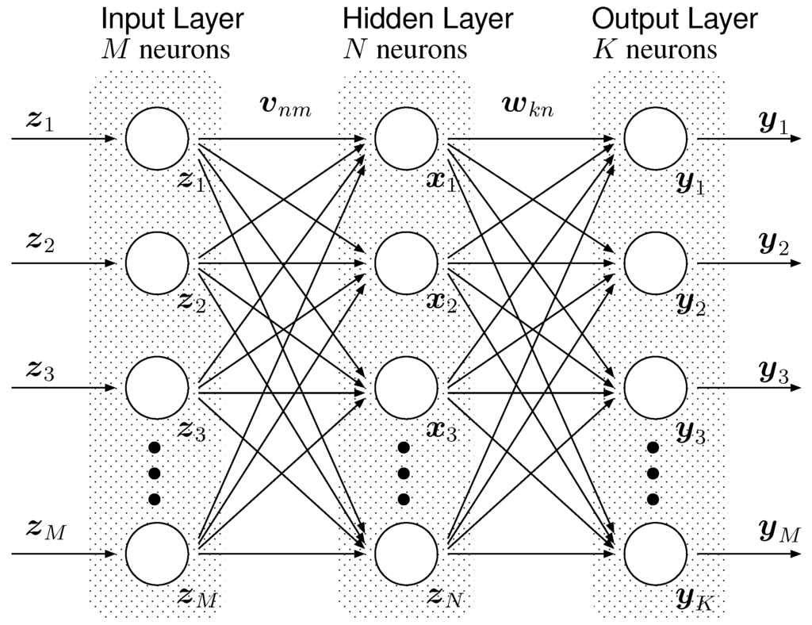
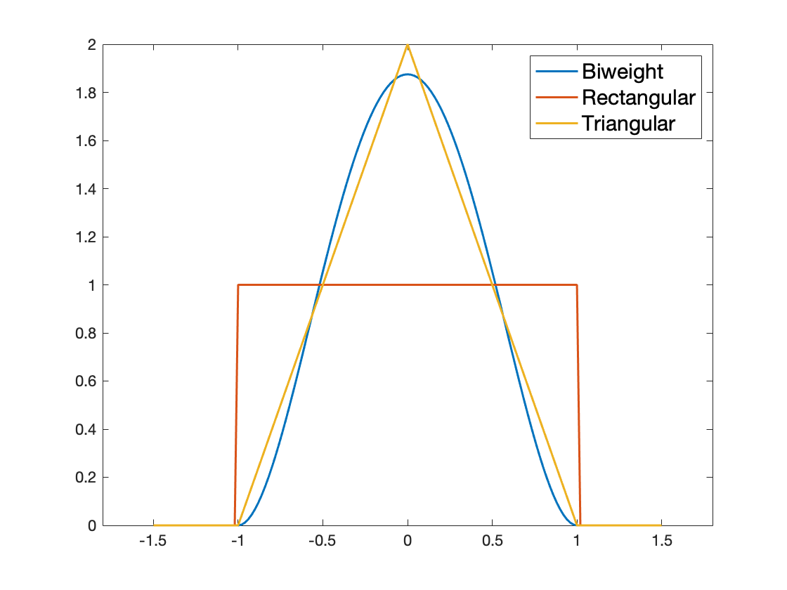
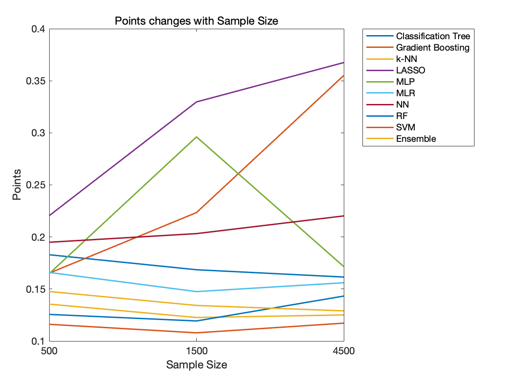
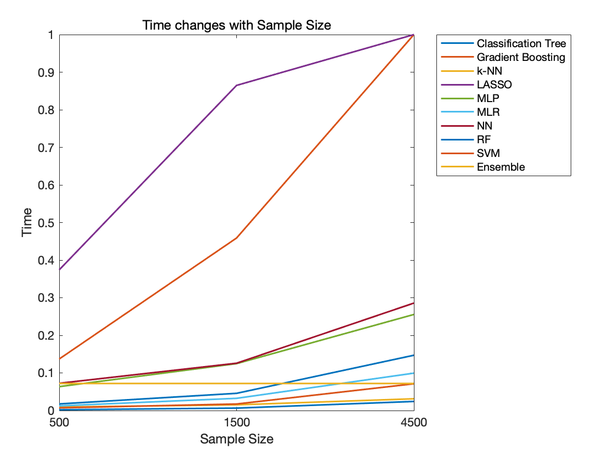
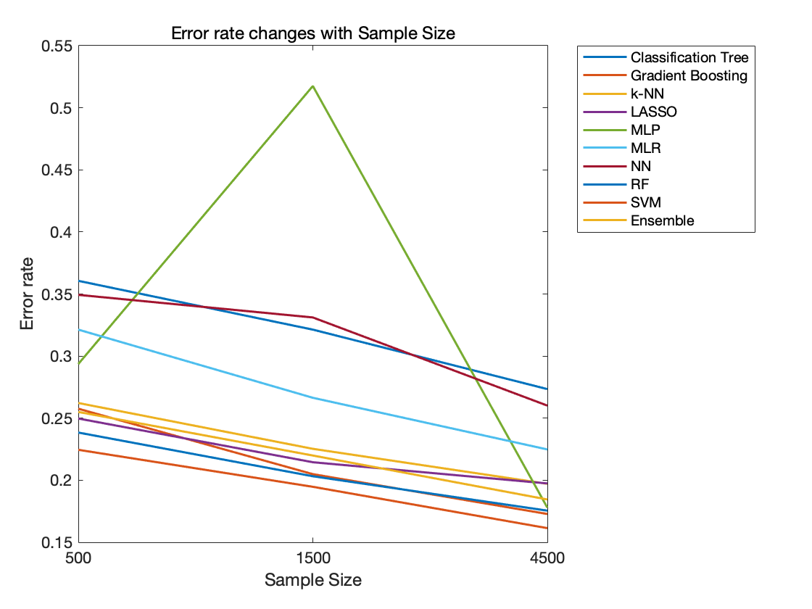
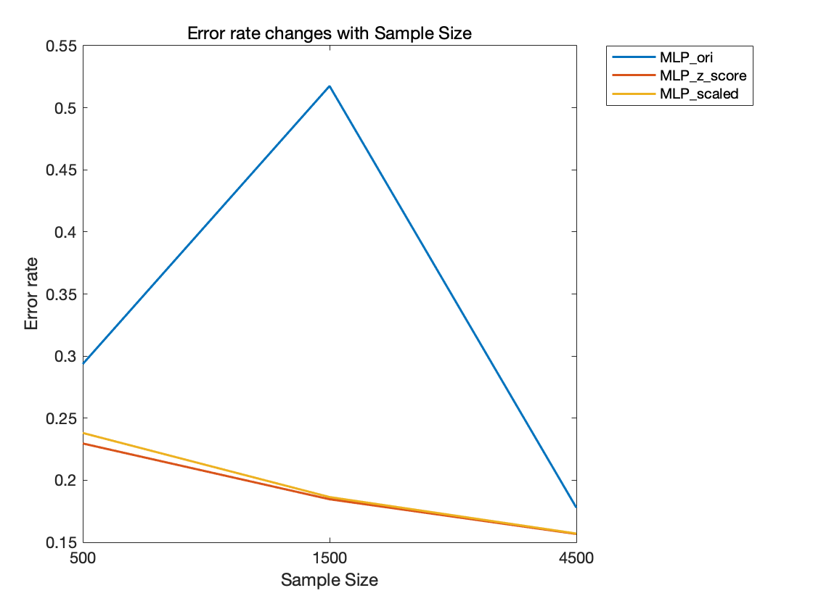
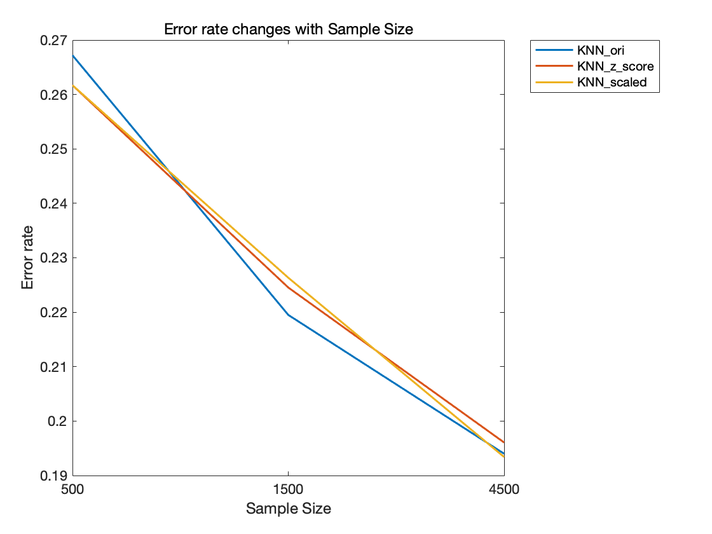
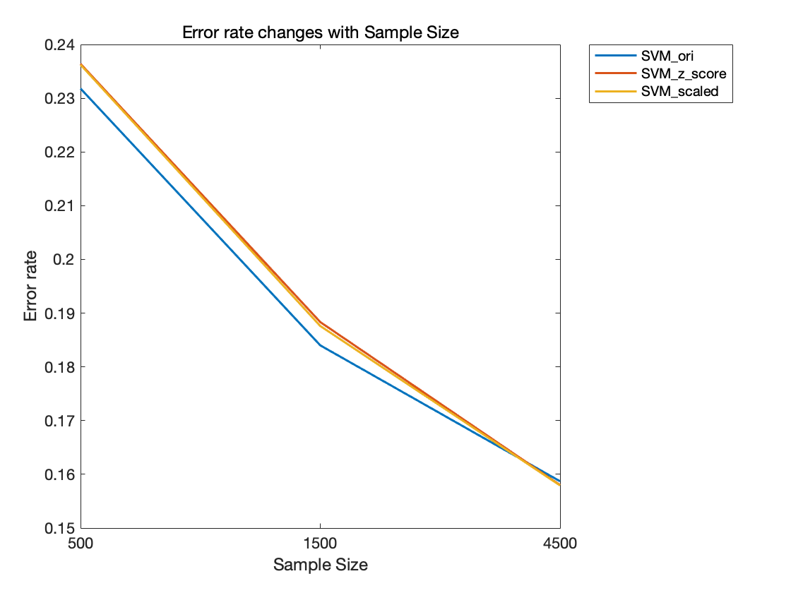
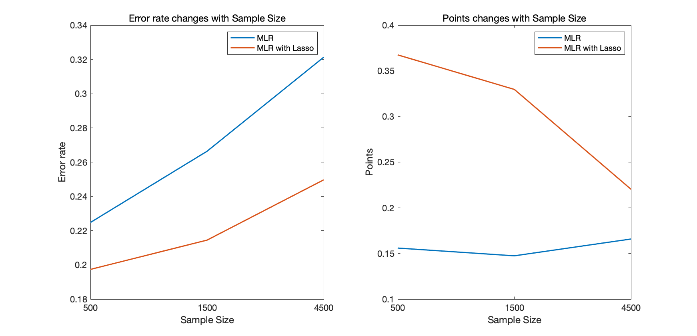
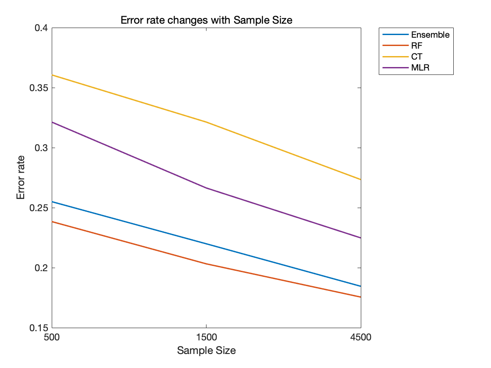

```{r setup, include=FALSE}
set.seed(72)
knitr::opts_chunk$set(echo = TRUE, comment="", warning = FALSE, message = FALSE, tidy.opts=list(width.cutoff=55))
```

```{r libraries, echo = FALSE}
library(data.table)
library(DT)
library(dplyr)
library(keras)
library(randomForest)
library(xgboost)
library(glmnet)
library(rpart)
library(e1071)
library(nnet)
library(class)
library(kknn)
library(DMwR)
library(caret)
library(rlist)
library(Formula)
library(tfruns)
library(tfdeploy)
```

```{r functions}
#function for model accuracy
acc.est<-function(pred,actual){
  return(mean(unlist(pred)==actual))
}
#Round function
round.numerics <- function(x, digits){
  if(is.numeric(x)){
    x <- round(x = x, digits = digits)
  }
  return(x)
}

#Sampling function for model 1 to 6
sampling<-function(n,dat=dat_train){
  dt<-dat[sample(nrow(dat),n,replace = FALSE)]
  return(dt)
}
#Sampling function for model 7 to 9
sampling.preprocessed.data <- function(n.values, dat){
  data.list=list()
  for (j in 1:3) {
    for (i in 1:3){
      set.seed(i+n.values[j])
      a=sample(60000, n.values[j], replace = F)
      eval(parse(text=sprintf("dat.%i.%i=dat[%s,]", n.values[j],i,"a")))
      data.list=list.append(data.list, eval(parse(text=sprintf("dat.%i.%i", n.values[j],i))))
    }
  }
  return(data.list)
}
#Iteration function
iteration<-function(data.list,model){
  result.list<-lapply(data.list,model)
  p<-rep(NA)
  for(i in 1:length(value.list)){
    p[i]<-result.list[[i]][1]
  }
  pred.list<-rep(NA)
  for(i in 1:length(value.list)){
    pred.list[i]<-result.list[[i]][2]
  }
  output.model<-do.call(rbind, p)
  output.model[,Data:=names(train.list)]
  setcolorder(output.model,c("Model","Sample Size","Data","A","B","C","Points"))
  output.model %>% mutate_if(is.numeric,round,digits=4) %>%as.data.table(.)->result
  return(list(result,pred.list))
}

#Scoring function
score.eval<-function(a,b,c){
  return(0.25*a+0.25*b+0.5*c)
}
#Scoring summary function
score.summary<-function(table){
  result <- table %>%
  group_by(Model,`Sample Size`)%>%
  summarise_if(is.numeric, funs(mean))%>%
  mutate_if(is.numeric,round,digits=4)
  
  return(result)
  
}
#Creating formula for k-NN and SVM
create.formula.not.chr.func<-function(dat){
  name=grep(names(dat), pattern = "label", value = T)
  eval(parse(text=sprintf("the.formula=as.factor(%s) ~ .", name)))
  the.formula=Formula(the.formula)
  return(the.formula)
}

```

```{r constants}
min.num<-60
n.values <- c(500, 1500, 4500)
iterations <- 3
value.list<-sort(rep(n.values,3))
label.name<-"label"
class.value<-as.character(c(0:9))
size.list<-rep(n.values,times=iterations)
```

```{r load_data}
dat_train<-fread(input = "../Data/MNIST-fashion training set-49.csv", sep = ",",fill = TRUE)
dat_test<-fread(input = "../Data/MNIST-fashion testing set-49.csv", sep = ",",fill = TRUE)
```

```{r clean_data}
#we should change label to 0 to 9
class.name<-dat_train[,unique(get(label.name))]
dat_train[, eval(label.name):=as.character(as.numeric(as.factor(get(label.name)))-1)]
dat_test[, eval(label.name):=as.character(as.numeric(as.factor(get(label.name)))-1)]

train.labels.num=dat_train[, as.numeric(get(label.name))]
test.labels.num=dat_test[, as.numeric(get(label.name))]

#prepare preprocessed data for SVM, k-NN, and MLP
train.images=dat_train[, .SD, .SDcols=setdiff(names(dat_train), "label")]
train.images.scaled=train.images/255
train.labels.factor=dat_train[, as.factor(label)]
preObj=preProcess(train.images, method=c("center", "scale"))
train.images.z.score=predict(preObj, train.images)

test.images=dat_test[, .SD, .SDcols=setdiff(names(dat_test), "label")]
test.images.scaled=test.images/255
test.labels.factor=dat_test[, as.factor(label)]
preObj=preProcess(test.images, method=c("center", "scale"))
test.images.z.score=predict(preObj, test.images)

train.images.scaled.mat=as.matrix(train.images.scaled)
test.images.scaled.mat=as.matrix(test.images.scaled)

train.z.score=cbind.data.frame(train.images.z.score, train.labels.factor)
train.scaled=cbind.data.frame(train.images.scaled, train.labels.num)
```

```{r generate_samples}
#generate samples for model 1 to 6
set.seed(72)
lapply(value.list,sampling)->train.list
names(train.list)<-c("dat_500_1","dat_500_2","dat_500_3","dat_1500_1","dat_1500_2","dat_1500_3","dat_4500_1","dat_4500_2","dat_4500_3")

#This is sampling process for KNN, SVM, and MLP
train.z.score.list=sampling.preprocessed.data(n.values=n.values, dat=train.z.score)
names(train.z.score.list)<-c("dat_500_1_zscore","dat_500_2_zscore","dat_500_3_zscore","dat_1500_1_zscore","dat_1500_2_zscore","dat_1500_3_zscore","dat_4500_1_zscore","dat_4500_2_zscore","dat_4500_3_zscore")

train.scaled.list=sampling.preprocessed.data(n.values=n.values, dat=train.scaled)
names(train.scaled.list)<-c("dat_500_1_scaled","dat_500_2_scaled","dat_500_3_scaled","dat_1500_1_scaled","dat_1500_2_scaled","dat_1500_3_scaled","dat_4500_1_scaled","dat_4500_2_scaled","dat_4500_3_scaled")
```

## **1 Introduction**

*Fashion-MNIST* is a dataset with a training set of 60,000 examples and a test set of 10,000 examples. Each example is a 28x28 grayscale image (the pixel values range from 0 (white) to 255 (black)), associated with labels from 10 classes [1]. For more tractable computations, we have condensed these data into 7x7 image. In this paper, we are trying to compare various machine learning methods and to explore how the factors like sample size and tuning parameters would affect the runtime and accuracy. All together ten models, Random Forest, Gradient Boosting, Classification Tree, Multinomial Logistic Regression (with or without Lasso), Multilayer Perceptron (MLP), Support Vector Machine (SVM), Weighted k-nearest neighbors (k-NN), and an ensembled model were constructed. The continuing sections are organized as follows. In Section 2, we will give a brief introduction to the mechanism of the methods used. In Section 3, we will present all of our results. Finally, in Section 4, we will provide detailed comparison and discussions.

## **2 Methods**

### **2.1 Random Forest**

When fit the model, it is better to select model which can overcome bagging limitation. Based on the basic knowledge of random forest (RF), it is an ensemble learning method for classification or regression [2]. Random forest uses bootstrap samples to build trees. They are bagged trees except that we also choose random subsets of features for each tree. The estimator can be written as 

$$\hat{m}(x) = \frac{1}{M}\sum_{j}\hat{m}_j(x)$$

where $m_j$ is a tree estimator based on a subsample (or bootstrap) of size $a$ using $p$ randomly selected features. On the other hand, overfitting will not happen in Random Forest model. It is valuable to consider random forest model to predict what kind of clothes presenting in picture belongs to. 

### **2.2 Gradient Boosting**

For this classification problem, Gradient boosting (GB) maybe a great choice [3]. Gradient boosting is a machine learning technique for regression and classification problems, which produces a prediction model in the form of an ensemble of weak prediction models, typically decision trees. (Wiki) The objective of any supervised learning algorithm is to define a loss function and minimize it. Let's see how math work out for Gradient Boosting algorithm. We want our predictions, such that our loss function (MSE) is minimum. By using gradient descent and updating our predictions based on a learning rate, we can find the values where MSE is minimum. 
\[
y_i^p=y_i^p+\alpha*\beta\sum(y_i-y_i^p)^2/\beta y_i^p\\
y_i^p=y_i^p-2\alpha\sum (y_i-y_i^p)\\
where\ \alpha  \ is \ learn \  rate \ and \sum (y_i-y_i^p)\ is \ sum\ of\ residuals
\]
So, we are basically updating the predictions such that the sum of our residuals is close to 0 (or minimum) and predicted values are sufficiently close to actual values. This is basic knowledge of gradient boosting. Because we need to solve classification problem, we should not get any prediction number with decimals. In our model, we use "multi:: softmax" to do classification. This method maybe time-consuming but will increase model accuracy. 

### **2.3 Multinomial Logistic Regression and Lasso**

Multinomial logistic regression (MLR) is a classification method that generalizes logistic regression to multiclass problems. It can be used when the response variable in question is nominal. Rather than modeling this response variable directly, MLR models the probability that response variable belongs to a particular category. [4]

However, in real life, MLR sometimes cannot preform well so we consider regularization model of MLR and we choose Lasso regression because there are 49 features which can be selected using Lasso. The basic idea of lasso regression is that adding penalty, which is the absolute value of the magnitude of coefficients, to the sum of squares. 
\[ \sum_{i=1}^n(y_i-\sum_{j}x_{ij}\beta_j)^2+\lambda\sum_{i=1}^p\beta_j\]
where $y_i$ is the logit. This type of regularization can result in sparse models with few features. Some coefficients will become zero and the corresponding features will be eliminated from the model. Larger penalties $\lambda$ result in coefficient values closer to zero, which is the ideal for producing simpler models. We use glmnet package in R to build our lasso regression model and we can consider cross validation in our model. 

### **2.4 Classification Tree**
Classification tree is used to predict a qualitative response rather than a quantitative one. For a classification tree, we predict that each observation belongs to the most commonly occurring class of training observations in the region to which it belongs. [4]

### **2.5 Neural Networks**
In this paper, we are only focused on Multilayer Perceptron (MLP). MLP is a very basic model in Deep Learning field. It uses weighted-fully-connections to connect input layer, hidden layer, and output layer, which is basically matrix multiplication and non-linear activation. The basic structure is shown in **Figure 1** [5]. MLP approximates the relationship between input and output by updating its weight matrix *W*, in an iterative way and the goal is to get the best possible representation of this relationship. In supervised learning, MLP compares its prediction with the ground truth (label) to minimize the loss function.

<center>

{width=50%}

</center>

Dropout is a way of regularization in MLP. It provides an computationally inexpensive way to make bagging practical for the ensembles of many neural networks. During the training, all neurons except output neurons will be randomly dropped out to form many sub-networks. So basically training one network with Dropout is like training many subnetworks which yields stable results and prevents overfitting. The mechanism is illustrated in **Figure 2** [6]. 

<center>

{width=50%}

</center>

In this paper, two types of MLP were developed. First, one single hidden layer MLP was developed using "nnet" package. Second, two hidden layers with two dropout layers MLP was developed using "keras" package. RMSProp, an adaptive learning optimizer, was used and Softmax output layer was implemented to compute the prediction for the model. In addition, Grid Search was performed to tune the parameters for each sample size for this model.

### **2.6 Support Vector Machine**
Support vector machine (SVM) aims to find the hyperplane that has the max margin to separate the classes. The points that support the max margin hyperplane are called support vectors. In order to avoid the no-separation cases, slack variables are introduced for more general cases.

In a binary classification case [4], for a set of $n$ training observations, $x_1,...,x_n\in \mathbb{R}^p$, and class labels $y_1...,y_n\in \{-1,1\}$, The support vector machine can be derived by operating the following optimization:
$$\mathop{\max}\limits_{\beta_j,\epsilon_j,M}M \qquad subject\ to\ \sum\beta_j^2=0,$$
$$y_i(\beta_0+\sum_{i\in S}\alpha_ik(x,x_i))\geq M(1-\epsilon_i),$$
$$\epsilon_i\geq 0, \  \ \ \sum_{i=1}^n\epsilon_i \leq C$$

Here $\epsilon_i$ are slack variables, $C$ is the budget of slackness, $k(x,x_i)$ is the kernel of the SVM, $\beta_j$ are variables in the kernel.

The RBF (radial basic function) kernel used in this paper is:
$$k(x,x_i)=e^{-\frac{\gamma (x-x_i)^2}{\sigma}}$$

Also, Grid Search was performed to tune the parameters for this model.


### **2.7 Weighted k-Nearest Neighbors**
Standard k-Nearest Neighbors (k-NN) method is to determine the prediction for new data according to their nearest neighbors in the training data. Given a positive integer $k$, the kNN classifier first looks for the $k$ points closest to the point $x_0$, which can be presented as $N_0$. Then the point $x_0$ is considered to have the following conditional probability [7]:
$$\Pr (Y=j|X=x_0)=\frac{1}{k}\sum_{i\in N_0}I(y_i=j)$$

Then, the point will be classified to a specific class that have the maximum number of nearest neighbors to it.

Weighted distance kNN is a refinement of the standard kNN [8]. It weights the nearest neighbors according to their distance to the test data point. The closer of the neighbors to the test point, the greater the weight of the neighbors. In this case, the conditional probability is changed to:
$$\Pr (Y=j|X=x_0)=\frac{\sum_{i\in N_0}w_iI(y_i=j)}{\sum_{i\in N_0}w_i}$$
The weight is determined by the kernel of the classifier. The standard kNN can be seen as kNN with rectangular kernel. In this study, we also used triangular kernel and biweight (beta distribution, $beta(3,3)$) kernel. These kernels put more weights on the closer data points as shown in **Figure 3**.

<center>

{width=50%}

</center>


### **2.8 Ensemble Model**
Ensemble methods uses multiple learning algorithms to obtain better predictive performance than could be obtained from any of the constituent learning algorithms alone [9]. Here, a model that basically learns from other models’ results and outputs a new result by majority voting was constructed.

### **2.9 Preprocessing methods**
Z-score and min-max normalization were impelemented in this paper. Z-score normalizes the data to have mean of 0 with unit variance according to this formula:
$$z_i=\frac{x_i-\overline{x}}{s_x}$$

where $\overline{x}$ is the mean of the data and $s_x$ is the standard deviation of the data. 

Min-max normalization scales the data to the range [0,1], which follows this formula: for every data point, we have
$$x'=\frac{x-x_{min}}{x_{max}-x_{min}}=\frac{x}{255}$$

where, for our data, $x_{min}=0$ and $x_{max}=255$, then we will have the equation shown above.

### **2.10 Evaluation**
A scoreboard was constructed where three metrics were adopted to evaluate each machine learning method. Each method has a score calculated from **Points = 0.25 * A + 0.25 * B + 0.5 * C**, where A, the proportion of the training data out of 60000 training samples, B, the running time (unit: second) including tuning parameters, fitting, and predicting, and C, the error rate. Note that when B is greater than 60 seconds, it is set to 1, otherwise set to the ratio of B and 60. Our goal is to build a classification method that minimizes the value of Points.


## **3 Results**

### **3.1 Random Forest**

```{r code_Random Forest, eval = TRUE}
rf.model<-function(dat,test=dat_test){
  toc <- Sys.time()
  y_test<-as.matrix(test[,1])
  
  
  model.rf<-randomForest(as.factor(label)~.,data=dat)
  pred.rf <-list(predict(object = model.rf, newdata = test))
  
  
  acc<-acc.est(pred.rf,y_test)
  tic <- Sys.time()
  the.time <- as.numeric(x = tic-toc, units = "secs")
  nrow(dat)/nrow(dat_train)->a
  min(1,the.time/min.num)->b
  1-acc->c

  result<-data.table("Model"="Random Forest",
                     "Sample Size"=nrow(dat),
                     "A"=a,
                     "B"=b,
                     "C"=c,
                     "Points"=score.eval(a,b,c)
                     )
  return(list(result,list(pred.rf,the.time)))
}
```

```{r load_model1}
rf.result<-iteration(train.list,rf.model)
rf.table<-rf.result[[1]]
datatable(rf.table)
```

We apply package "randomForest" to fit our model. After running model, the accuracy for our selected is between 75% and 85% and it shows that random forest model does a great job to for future prediction. And it is not time-consuming. Another advantage of this model is that there is no need to spend much time on tuning model. Based on the code, even the parameters in "randomForest" function are ignored, and it still generates model with great accuracy. 

### **3.2 Gradient Boosting** 

```{r code_gradient boosting, eval = TRUE}
gradboost.model<-function(train,test=dat_test){
  
  x_train<-as.matrix(train[,-1])
  y_train<-as.matrix(train[,1])
  x_test<-as.matrix(test[,-1])
  y_test<-as.matrix(test[,1])
  
  toc <- Sys.time()
  params <- list(eta = 0.01,max_depth = 7,min_child_weight = 7,subsample = 0.65,colsample_bytree = 0.9,num_class=10)
  xgb.fit.final <- xgboost(params = params,data = x_train,label = y_train,nrounds = 504,nfold=5,objective ="multi:softmax",verbose = 0)
  
  pred.xgb <- list(predict(xgb.fit.final, x_test))
  tic <- Sys.time()
  
  acc.est(pred.xgb,y_test)->acc
  
  the.time <- as.numeric(x = tic-toc, units = "secs")
  nrow(train)/nrow(dat_train)->a
  min(1,(the.time)/min.num)->b
  1-acc->c

  result<-data.table("Model"="Gradient Boosting",
                     "Sample Size"=nrow(train),
                     "A"=a,
                     "B"=b,
                     "C"=c,
                     "Points"=score.eval(a,b,c)
                     )
  return(list(result,list(pred.xgb,the.time)))
}
```


```{r save_model2, eval=FALSE, echo=TRUE}
xgb.result<-iteration(train.list,gradboost.model)
gradboost.table<-xgb.result[[1]]
# save the results due to the extreme long runtime
saveRDS(gradboost.table, "../saved_results/gradboost_table.rds")
```

```{r load_model2, eval=TRUE, echo=TRUE}
# load back the saved result
gradboost.table=readRDS("../saved_results/gradboost_table.rds")
datatable(gradboost.table)
```

After running gradient boosting model, the points on the table shows that the misclassification rate is about 20% and the running time is always greater than 60 seconds. Because in this model, there exists many parameters, we need spend much time on tune process and of course it is time consuming. But for consistency, we will discuss parameter tuning time in Section 4. This model is a possible way to do classification, but comapring to other model, gradient boosting model maybe lose its advantage. 

### **3.3 MLR with lasso**  


```{r code_Lasso Regression, eval = TRUE}
lasso.model<-function(train,test=dat_test){
  
  x_train<-as.matrix(train[,-1])
  y_train<-as.matrix(train[,1])
  x_test<-as.matrix(test[,-1])
  y_test<-as.matrix(test[,1])
  
  toc <- Sys.time()
  outLm <- cv.glmnet(x_train, y_train, alpha=1, nfolds=5,family="multinomial")
  predLm <- apply(predict(outLm, x_test, s=outLm$lambda.min,type="response"), 1, which.max) - 1L
  tic <- Sys.time()
  
  mean(predLm==y_test)->acc
  the.time <- as.numeric(x = tic-toc, units = "secs")
  nrow(train)/nrow(dat_train)->a
  min(1,the.time/min.num)->b
  1-acc->c
  
  result<-data.table("Model"="Lasso",
                     "Sample Size"=nrow(train),
                     "A"=a,
                     "B"=b,
                     "C"=c,
                     "Points"=score.eval(a,b,c)
                     )
  return(list(result,list(predLm,the.time)))
}
```

```{r save_model3, eval=FALSE, echo=TRUE}
lasso.result<-iteration(train.list,lasso.model)
lasso.table<-lasso.result[[1]]
# save the results due to the extreme long runtime
saveRDS(lasso.table, "../saved_results/lasso_table.rds")
```

```{r load_model3, eval=TRUE, echo=TRUE}
# load back the saved result
lasso.table=readRDS("../saved_results/lasso_table.rds")
datatable(lasso.table)
```

In the model, I just set the folds of cross validation is 5. The accuracy of this model on test dataset is between 75% and 80%. The advantage of this model is that understanding the theory of lasso regression is much easier than other models. But when we train this model, this process is very time consuming. 

### **3.4 Classification Tree**

```{r code_model4_classificition tree, eval = TRUE}
tree_function <- function(traindata,testdata = dat_test){
  num <- dim(traindata)
  time1 <- Sys.time()
  fit <- rpart(label ~., data = traindata, method = 'class',control = rpart.control(cp = 0.00001))
  pred <- predict(fit, testdata, type = 'class')
  time2 <- Sys.time()
  Time1 <- as.numeric(time2- time1)
  count <- table(pred, testdata$label)
  count1 <- sum(diag(count))
  a=num[1]/60000
  b=min(1,Time1/60)
  c=1-count1/10000
  result<-data.table("Model"="Classification Tree",
                     "Sample Size"=nrow(traindata),
                     "A"=a,
                     "B"=b,
                     "C"=c,
                     "Points"=score.eval(a,b,c)
                     )
  return(list(result,list(pred,Time1)))
}
```

```{r load_model4}
ct.result<-iteration(train.list,tree_function)
ct.table<-ct.result[[1]]
datatable(ct.table)
```

Since random forest is a collection of classification tree, classification tree model is as accurate as random forest model but it gains the time advantage. The accuracy of classification tree is around 64%~83% which is less than most of our other models. Overall, classification tree did a good job on points because of the fast speed. 

### **3.5 Multinomial Logistic Regression**

```{r code_model5_MLR, eval = TRUE}
mlr_function <- function(traindata,testdata = dat_test){
  num <- dim(traindata)
  time1 <- Sys.time()
  invisible(capture.output(fit <- multinom(label ~., data = traindata,maxit = 200)))
  pred <- predict(fit, testdata, type = 'class')
  time2 <- Sys.time()
  Time1 <- as.numeric(time2- time1)
  count1 <-sum(pred==testdata$label)
  #plot(birthwtTree)
  #text(birthwtTree, use.n = TRUE)
  a=num[1]/60000
  b=min(1,Time1/60)
  c=1-count1/10000
  result<-data.table("Model"="MLR",
                     "Sample Size"=nrow(traindata),
                     "A"=a,
                     "B"=b,
                     "C"=c,
                     "Points"=score.eval(a,b,c)
                     )
  return(list(result,list(pred,Time1)))
}
```

```{r load_model5}
mlr.result<-iteration(train.list,mlr_function)
mlr.table<-mlr.result[[1]]
datatable(mlr.table)
```

The MLR model has roughly 75% accuracy rate. By adding more training samples can improve the accuracy rate but taking more time. So adding more training sample to the model will not increase but lower the points. Therefore it is a trade off concern in MLR model. Seen from the table above, 1500 sample size has the lowest points. 


### **3.6 Multilayer Perceptron (nnet package)**

```{r code_model6_development, eval = TRUE}
Networks_function <- function(traindata,testdata = dat_test){
  num <- dim(traindata)
  #tune.nnet(as.factor(label) ~.,data = data500_1,type = 'class',size = 1:30, rang = 0:1,
#               decay = 0:0.5, maxit = 200,MaxNWts=5000)
  time1 <- Sys.time()
  invisible(capture.output(fit <- nnet(as.factor(label) ~.,data = traindata,type = 'class',size = 30, rang = 0.1,
               decay = 5e-4, maxit = 200,MaxNWts=5000)))
  pred <- predict(fit,testdata, type = 'class')
  time2 <- Sys.time()
  Time1 <- as.numeric(time2- time1)
  count1 <-sum(pred==testdata$label)
  #plot(birthwtTree)
  #text(birthwtTree, use.n = TRUE)
  a=num[1]/60000
  b=min(1,Time1/60)
  c=1-count1/10000
  result<-data.table("Model"="Neural Network",
                     "Sample Size"=nrow(traindata),
                     "A"=a,
                     "B"=b,
                     "C"=c,
                     "Points"=score.eval(a,b,c)
                     )
  return(list(result,list(pred,Time1)))
}
```

```{r load_model6}
neural.result<-iteration(train.list,Networks_function)
neural.table<-neural.result[[1]]
datatable(neural.table)
```

Since nnet function constructs a single layer neural network, the accuracy of this model has relative low accuracy rate. Also, due to the complex structure of neural network, it takes relative long time to process. Our model uses tune.nnet function to compute the optimized parameters. It optimizes size, decay and rang values. If we increase size or iteration number, the time will significantly increase, and it is waste of computing power in this case. The lowest points are from 500 sample size. 


### **3.7 Weighted k-NN**

```{r code_model7_KNN, eval = TRUE}
knn.fit.func <- function(data, test.x, test.y, k=5, kernel="rectangular") {
    the.formula=create.formula.not.chr.func(data)
    toc <- Sys.time()
    knn.fit=kknn(formula = the.formula, data, test.x, k=k)
    knn.pred=fitted(knn.fit)
    tic <- Sys.time()
    temp=confusionMatrix(knn.pred, test.y)
    t=as.numeric(x = tic-toc, units = "secs")
    return (list(temp[["overall"]][["Accuracy"]], t))
}
knn.func <- function(data, test.x, test.y, is.tuning=TRUE){
  if (is.tuning){
  # tune
  the.formula=create.formula.not.chr.func(data)
  toc <- Sys.time()
  temp=train.kknn(formula = the.formula, data=data, kmax=20, distance=2, scale=F, kcv=10,
                  kernel = c("rectangular", "triangular", "epanechnikov","biweight","triweight",
                             "gaussian", "rank", "optimal"))
  tic <- Sys.time()
  time.knn.tune=as.numeric(x = tic-toc, units = "secs")
  k=temp[["best.parameters"]][["k"]]
  kernel=temp[["best.parameters"]][["kernel"]]
  } else {
    k=5
    kernel="rectangular"
    time.knn.tune=0
  }
  # fit
  fit.temp=knn.fit.func(data=data,test.x=test.x, test.y=test.y, k=k, kernel=kernel)
  acc.knn=fit.temp[[1]]
  time.knn=fit.temp[[2]]
  a=nrow(data)/60000
  b=min(1, time.knn/60)
  c=1-acc.knn
  result<-data.table("Model"="KNN",
                     "Sample Size"=nrow(data),
                     "A"=a,
                     "B"=b,
                     "C"=c,
                     "Points"=score.eval(a,b,c))
  return(result)
}
# Function of Iteration
knn.itr<-function(data.list,model,test.x,test.y,is.tuning=TRUE){
  output.each.dat<-lapply(data.list,model,test.x=test.x,test.y=test.y,is.tuning=is.tuning)
  output.model<-do.call(rbind, output.each.dat)
  output.model[,Data:=names(train.list)]
  setcolorder(output.model,c("Model","Sample Size","Data","A","B","C","Points"))
  output.model %>% mutate_if(is.numeric,round,digits=4) %>%as.data.table(.)->result
  return(result)
}
```

First, **knn.fit.func** was developed for fitting knn model, which returns the current test accuracy and runtime of fitting and predicting. Then, **knn.func** incorporated the parameter tuning process and **knn.fit.func**, which directly applied the best parameters found by grid search to the **knn.fit.func** and generated one row of final scoreboard. Note that there is a switch could be used to turn on or off the tuning. Finally, **knn.itr** applied each best model to all 9 training datasets and generated the final scoreboard for k-NN method.


```{r save_knn_ori, eval=FALSE, echo=TRUE}
knn.table=knn.itr(train.list, knn.func, test.x=test.images, test.y=test.labels.factor, is.tuning = TRUE)
# save the results due to the extreme long runtime
saveRDS(knn.table, "../saved_results/knn_table.rds")
```

```{r load_knn_ori}
# load back the saved result
knn.table=readRDS("../saved_results/knn_table.rds")
datatable(knn.table)
```

```{r save_knn_z_score, eval=FALSE, echo=TRUE}
knn.z.score.table=knn.itr(train.z.score.list, knn.func, test.x=test.images.z.score, test.y=test.labels.factor, is.tuning = TRUE)
# save the results due to the extreme long runtime
saveRDS(knn.z.score.table, "../saved_results/knn_zscore_table.rds")
```

```{r load_knn_z_score}
# load back the saved result
knn.z.score.table=readRDS("../saved_results/knn_zscore_table.rds")
datatable(knn.z.score.table)
```

```{r save_knn_scaled, eval=FALSE, echo=TRUE}
knn.scaled.table=knn.itr(train.scaled.list, knn.func, test.x=test.images.scaled, test.y=test.labels.factor, is.tuning = TRUE)
# save the results due to the extreme long runtime
saveRDS(knn.scaled.table, "../saved_results/knn_scaled_table.rds")
```

```{r load_knn_scaled}
# load back the saved result
knn.scaled.table=readRDS("../saved_results/knn_scaled_table.rds")
datatable(knn.scaled.table)
```

As shown in the tables above, the scoreboards for k-NN method were constructed on the original dataset, with z-score preprocessing dataset, and with min-max preprocessing dataset. The accuracy is 75%~80% and the points are 0.12~0.13. The time consumption is not large for k-NN method.


### **3.8 Support Vector Machine**

```{r tune_svm, eval=FALSE, echo=TRUE}
svm.tune.func<-function(data){
  the.formula=create.formula.not.chr.func(data)
  toc <- Sys.time()
  temp=tune.svm(the.formula, data=data, 
                gamma=c(0.004,0.005, 0.0075, 0.01, 0.03, 0.05), cost=c(4,6,8,10,12,14), kernel="radial" )
  tic <- Sys.time()
  time.svm.tune=as.numeric(x = tic-toc, units = "secs")
  gamma=temp[["best.parameters"]][["gamma"]]
  cost=temp[["best.parameters"]][["cost"]]
  svm.fit=svm(formula=the.formula, data=data, gamma=gamma, cost=cost, kernel="radial")
  return(list(svm.fit,time.svm.tune))
}
```

We first tuned the SVM to obtain the optimal parameters for each sample size. Due to the extreme long tuning process and the demand of consistency, we did not add the tuning time into the total time and would be discussed in Section 4.

```{r code_model8_SVM, eval = TRUE}
svm.fit.func <- function(data, test.x, test.y, gamma=0.01, cost=10, kernel="polynomial") {
  the.formula=create.formula.not.chr.func(data)
  toc <- Sys.time()
  svm.fit=svm(formula=the.formula, data=data, gamma=gamma, cost=cost, kernel=kernel)
  svm.pred=predict(svm.fit, test.x)
  tic <- Sys.time()
  temp=confusionMatrix(svm.pred, test.y)
  t=as.numeric(x = tic-toc, units = "secs")
  return (list(temp[["overall"]][["Accuracy"]], t))
}
svm.func <- function(data, test.x, test.y){
  if (nrow(data)==1500){
  gamma=0.01;cost=6
} else if (nrow(data)==4500) {
  gamma=0.03;cost=4
} else {
  gamma=0.03;cost=8
}
  # fit
  fit.temp=svm.fit.func(data=data,test.x=test.x, test.y=test.y, gamma=gamma, cost=cost, kernel="radial")
  acc.svm=fit.temp[[1]]
  time.svm=fit.temp[[2]]
  a=nrow(data)/60000
  b=min(1, (time.svm)/60)
  c=1-acc.svm
  result<-data.table("Model"="SVM",
                     "Sample Size"=nrow(data),
                     "A"=a,
                     "B"=b,
                     "C"=c,
                     "Points"=score.eval(a,b,c))
  return(result)
}
svm.itr<-function(data.list,model,test.x,test.y){
  output.each.dat<-lapply(data.list,model,test.x=test.x,test.y=test.y)
  output.model<-do.call(rbind, output.each.dat)
  output.model[,Data:=names(train.list)]
  setcolorder(output.model,c("Model","Sample Size","Data","A","B","C","Points"))
  output.model %>% mutate_if(is.numeric,round,digits=4) %>%as.data.table(.)->result
  return(result)
}
```

First, **svm.fit.func** was developed for fitting svm model, which returns the current test accuracy and runtime of fitting and predicting. Then, **svm.func** employed **svm.fit.func**, which has an assertion on the rows of the input data in order to apply corresponding optimal parameters obtained from tuning process and also generated one row of final scoreboard. Finally, **svm.itr** applied each best model to all 9 training datasets and generated the final scoreboard for SVM method.


```{r save_svm_ori, eval=FALSE, echo=TRUE}
svm.table=svm.itr(train.list, svm.func, test.x=test.images, test.y=test.labels.factor)
# save the results due to the extreme long runtime
saveRDS(svm.table, "../saved_results/svm_table.rds")
```

```{r load_svm_ori}
# load back the saved result
svm.table=readRDS("../saved_results/svm_table.rds")
datatable(svm.table)
```

```{r save_svm_z_score, eval=FALSE, echo=TRUE}
svm.z.score.table=svm.itr(train.z.score.list, svm.func, test.x=test.images.z.score, test.y=test.labels.factor)
# save the results due to the extreme long runtime
saveRDS(svm.z.score.table, "../saved_results/svm_zscore_table.rds")
```

```{r load_svm_z_score}
# load back the saved result
svm.z.score.table=readRDS("../saved_results/svm_zscore_table.rds")
datatable(svm.z.score.table)
```

```{r save_svm_scaled, eval=FALSE, echo=TRUE}
svm.scaled.table=svm.itr(train.scaled.list, svm.func, test.x=test.images.scaled, test.y=test.labels.factor)
# save the results due to the extreme long runtime
saveRDS(svm.scaled.table, "../saved_results/svm_scaled_table.rds")
```

```{r load_svm_scaled}
# load back the saved result
svm.scaled.table=readRDS("../saved_results/svm_scaled_table.rds")
datatable(svm.scaled.table)
```

As shown in the tables above, the scoreboards for SVM method were constructed on the original dataset, with z-score preprocessing dataset, and with min-max preprocessing dataset. The accuracy is 80%~85% and the points are 0.10~0.12. The time consumption is not large for SVM method.


### **3.9 Multilayer Perceptron (keras package)**

```{r code_model9_MLP, eval = TRUE}
mlp.fit.func <- function(train.x, train.y, test.x, test.y,
                         batch_size=32,
                         epochs=100,
                         units1=128,
                         dropout1=0.2,
                         units2=64,
                         dropout2=0.2,
                         lr=1e-3){
toc <- Sys.time()
batch_size=batch_size
epochs=epochs
model <- keras_model_sequential()
model %>%
  layer_dense(units = units1, activation = 'relu', input_shape = c(49)) %>%
  layer_dropout(dropout1) %>%
  layer_dense(units = units2, activation = 'relu') %>%
  layer_dropout(dropout2) %>%
  layer_dense(units = 10, activation = 'softmax')
model %>% compile(
  loss = 'sparse_categorical_crossentropy',
  optimizer=optimizer_rmsprop(lr=lr),
  metrics=c('accuracy')
)
model %>% fit(
  as.matrix(train.x), as.matrix(train.y),
  batch_size = batch_size,
  epochs = epochs,
  verbose = 0,
  validation_split = 0.2
)
score <- model %>% evaluate(
  as.matrix(test.x), as.matrix(test.y),
  verbose = 0
)
tic <- Sys.time()
t=as.numeric(x = tic-toc, units = "secs")

return (list(score[[2]],t))
}

```

```{r MLP_tune, eval=FALSE, echo=TRUE}
# 500
tuning_run("MLP_pure_model_500.R", runs_dir = "mlp_tuning_500", flags = list(
  dropout1 = c(0.2, 0.3, 0.4),
  dropout2 = c(0.2, 0.3),
  units1 = c(64, 128, 256),
  units2 = c(64, 128, 256),
  bs = c(32, 64, 128),
  epochs= c(100),
  lr = c(1e-4, 5e-4, 1e-3, 5e-3, 1e-2))
)
# a=ls_runs(order = "metric_val_acc", runs_dir = "mlp_tuning_500")
# a=a[1:3,]
# 1500
toc <- Sys.time()
tuning_run("MLP_pure_model_1500.R", runs_dir = "mlp_tuning_1500", sample=0.8, flags = list(
  dropout1 = c(0.2, 0.3, 0.4),
  dropout2 = c(0.2, 0.3, 0.4),
  units1 = c(64, 128, 256),
  units2 = c(64, 128, 256),
  bs = c(32, 64, 128),
  epochs= c(100),
  lr = c(5e-4, 1e-3, 5e-3, 1e-2))
)
tic <- Sys.time()
time.mlp.1500.tune=as.numeric(x = tic-toc, units = "secs")
# 4500
toc <- Sys.time()
tuning_run("MLP_pure_model_4500.R", runs_dir = "mlp_tuning_4500", flags = list(
  dropout1 = c(0.2, 0.3, 0.4, 0.5),
  dropout2 = c(0.2, 0.3, 0.4),
  units1 = c(64, 128, 256, 512),
  units2 = c(64, 128, 256),
  bs = c(32, 64),
  epochs= c(100),
  lr = c(5e-4, 1e-3, 5e-3))
)
tic <- Sys.time()
time.mlp.4500.tune=as.numeric(x = tic-toc, units = "secs")
```

```{r MLP_fit_each_sample_size}
mlp.fit.each.sample.size <- function(cur_dat, test.x, test.y){
labelname=grep(names(cur_dat), pattern = "label", value = T)
train.xx=cur_dat[, .SD, .SDcols=setdiff(names(cur_dat), labelname)]
train.yy=cur_dat[,as.numeric(get(labelname))]
if (max(train.yy)>9){
  train.yy=train.yy-1
}
if (nrow(cur_dat)==1500){
  batch_size=32;epochs=100;units1=256;dropout1=0.4;units2=256;dropout2=0.2;lr=1e-3
} else if (nrow(cur_dat)==4500) {
  batch_size=64;epochs=100;units1=512;dropout1=0.3;units2=256;dropout2=0.4;lr=5e-4
} else {
  batch_size=32;epochs=100;units1=256;dropout1=0.2;units2=64;dropout2=0.3;lr=1e-3
}
temp=mlp.fit.func(train.x=train.xx, train.y=train.yy, test.x=test.x, test.y=test.y,
                  batch_size=batch_size,
                  epochs=epochs,
                  units1=units1,
                  dropout1=dropout1,
                  units2=units2,
                  dropout2=dropout2,
                  lr=lr)
acc.mlp=temp[[1]]
time.mlp=temp[[2]]
a=nrow(cur_dat)/60000
b=min(1, (time.mlp)/60)
c=1-acc.mlp
result<-data.table("Model"="MLP",
                   "Sample Size"=nrow(cur_dat),
                   "A"=a,
                   "B"=b,
                   "C"=c,
                   "Points"=score.eval(a,b,c))
return(result)
}
mlp.itr<-function(data.list,model,test.x,test.y){
  output.each.dat<-lapply(data.list,model,test.x=test.x,test.y=test.y)
  output.model<-do.call(rbind, output.each.dat)
  output.model[,Data:=names(train.list)]
  setcolorder(output.model,c("Model","Sample Size","Data","A","B","C","Points"))
  output.model %>% mutate_if(is.numeric,round,digits=4) %>% as.data.table(.)->result
  return(result)
}
```

First, **mlp.fit.func** was developed for fitting MLP model which basically constructs the model with two hidden layers and two dropout layers and returns the accuracy and runtime. Then, we called "tfruns" package to tune the parameters for each sample size which consumes enormous amount of time and would be discussed in Section 4. Then **mlp.fit.each.sample.size** employed **mlp.fit.func**, which has an assertion on the rows of the input data in order to apply corresponding optimal parameters obtained from tuning process and also generated one row of final scoreboard. Finally, **mlp.itr** applied each best model to all 9 training datasets and generated the final scoreboard for MLP method.

```{r save_MLP_ori, eval=FALSE, echo=TRUE}
mlp.table=mlp.itr(train.list, mlp.fit.each.sample.size, test.x=test.images, test.y=test.labels.num)
# save the results due to the extreme long runtime
saveRDS(mlp.table, "../saved_results/mlp_table.rds")
```

```{r load_MLP_ori}
# load back the saved result
mlp.table=readRDS("../saved_results/mlp_table.rds")
datatable(mlp.table)
```

```{r save_MLP_z_score, eval=FALSE, echo=TRUE}
mlp.z.score.table=mlp.itr(train.z.score.list, mlp.fit.each.sample.size, test.x=test.images.z.score, test.y=test.labels.num)
# save the results due to the extreme long runtime
saveRDS(mlp.z.score.table, "../saved_results/mlp_zscore_table.rds")
```

```{r load_MLP_z_score}
# load back the saved result
mlp.z.score.table=readRDS("../saved_results/mlp_zscore_table.rds")
datatable(mlp.z.score.table)
```

```{r save_MLP_scaled, eval=FALSE, echo=TRUE}
mlp.scaled.table=mlp.itr(train.scaled.list, mlp.fit.each.sample.size, test.x=test.images.scaled, test.y=test.labels.num)
# save the results due to the extreme long runtime
saveRDS(mlp.scaled.table, "../saved_results/mlp_scaled_table.rds")
```

```{r MLP_scaled}
# load back the saved result
mlp.scaled.table=readRDS("../saved_results/mlp_scaled_table.rds")
datatable(mlp.scaled.table)
```
 
As shown in the tables above, the scoreboards for MLP method were constructed on the original dataset, with z-score preprocessing dataset, and with min-max preprocessing dataset. For the original dataset, we found the accuracy varied a lot while for preprocessed dataset, the accuracy is stable and achieves similar high accuracy as SVM did. The time consumption is fairly a bit large for MLP method.


### **3.10 Ensemble Model**

```{r model10_ensemble_model}
#load prediction data for ensemble model
pred.data.rf=list()
pred.data.ct=list()
pred.data.mlr=list()
for (i in 1:9){
  a=rf.result[[2]][[i]]
  a[[1]]=unlist(a[[1]])
  b=ct.result[[2]][[i]]
  c=mlr.result[[2]][[i]]
  pred.data.rf=list.append(pred.data.rf,a)
  pred.data.ct=list.append(pred.data.ct,b)
  pred.data.mlr=list.append(pred.data.mlr,c)
}

```


```{r code_model10_development, eval = TRUE}
get_only_pre <- function(data){
  temp <- list(data[[1]][[1]],data[[2]][[1]],data[[3]][[1]],data[[4]][[1]],data[[5]][[1]],
               data[[6]][[1]],data[[7]][[1]],data[[8]][[1]],data[[9]][[1]])
  predata <- sapply(temp, as.character)
  predata
}


vote_function <-function(data1,data2,data3,testdata=dat_test,myfunction = get_only_pre){
  time1 <- Sys.time()
  test_label <- as.character(testdata$label)
  predata11 <- myfunction(data1)
  predata22 <- myfunction(data2)
  predata33 <- myfunction(data3)
  vote_result <-matrix(0,10000,9)
  
  for (i in 1:10000){
    for(j in 1:9){
      temp <-data.frame(table(c(as.character(predata11[i,j]),
                                as.character(predata22[i,j]),
                                as.character(predata33[i,j]))))
      temp <- temp[order(temp$Freq,decreasing = TRUE),]
      temp$Var1 <- as.character(temp$Var1)
      vote_result[i,j] <- temp$Var1[1]
    }
  }
  C <- c(sum(vote_result[,1]==testdata$label),sum(vote_result[,2]==testdata$label),
         sum(vote_result[,3]==testdata$label),sum(vote_result[,4]==testdata$label),
         sum(vote_result[,5]==testdata$label),sum(vote_result[,6]==testdata$label),
         sum(vote_result[,7]==testdata$label),sum(vote_result[,8]==testdata$label),
         sum(vote_result[,9]==testdata$label))
  time2 <- Sys.time()
  Time1 <- as.numeric(time2- time1)
  pred <- list(C,Time1)
  pred
}

```

```{r load_model10}
three_model_result <-vote_function(pred.data.rf,pred.data.ct,pred.data.mlr)
C <- 1-three_model_result[[1]]/10000
B <- min(1,three_model_result[[2]]/60)/9
A <- ct.table$A

ensemble.table <- data.table(
  "Model"=rep("Ensemble",9),
  "Sample Size"=value.list,
  "Data"=names(train.list),
  "A"=A,"B"=B,"C"=C,
  "Points" =0.25*A + 0.25*B +0.5*C)
datatable(ensemble.table%>% mutate_if(is.numeric,round,digits=4))

```

We used results from RF, Classification Tree, and MLR models to build our ensemble model. By taking majority vote from each model’s result, the result will use to account as the result of ensemble model. Since ensemble model uses the results from other models and it only needs to run though two for loops, it has a time advantage. Due to our ensemble model algorithm, it processes all sample datasets results as a whole dataset and the process time should be equally consumed. The accuracy rate of ensemble model is relatively good. 


## **3.11 Scoreboard**

```{r scoreboard}
table.list<-list(rf.table,gradboost.table,lasso.table,ct.table,mlr.table,neural.table,knn.table,svm.table,mlp.table,ensemble.table)
score.table<-do.call(rbind,table.list)
datatable(score.table)

score.summary.table<-do.call(rbind,lapply(table.list, score.summary))
setorderv(score.summary.table, cols = "Points", order=1)
datatable(score.summary.table)
```

## **4 Discussion**

### **4.1 Impact of A, B, and C on Points**

For all models, we found the pattern where the the runtime increases and error rate decreases with increasing sample sizes. The points however shows differently as most models points have a slight kink due to the increased runtime and accuracy, which means when we have sample size of `r n.values[2]`, the result might be more desirable given the balance of runtime and accuracy. If we gave more weights to A and B instead of C, the kink would then be more steep as the existence of this kink is mostly due to the consumption of less time and results of just a bit lower accuracy using `r n.values[2]` samples than using `r n.values[3]` samples.

However, the sample sizes chosen in this paper are `r n.values` which only take up a very small portion of the total 60000 training samples. If we have enough computing resources to explore a wider variety of models and sample sizes, we would choose more than 3 sample sizes and also larger sizes or even the full training set. In this way, we might be able to model the real relation among sample sizes, runtime, accuracy, and points.

<center>

{width=50%} 
{width=50%} 
{width=50%}

</center>


### **4.2 Data Normalization Influence**
From the final scoreboard, we found MLP did not do well in this task which is contradictory to our intuitive. The reason why this happen is because not only MLP truely consumes more time and is more complex, but requires larger data samples and also data normalization [10]. In more general case, data normalization need to be performed due to the various scale of the data. For example, 1000 dollars with units of *dollar* and that with units of *thousands of dollars* have much difference and will thus impact the parameters learned by the machine learning algorithms. If we first scale the data to make them all at the same scale, we will then have a more desirable result. Besides, normalization will give the error surface a more spherical shape, otherwise the surface would be a very high curvature ellipse. Having an error surface with high curvature will cause that we take many steps which aren't necessarily in the optimal direction. By normalizing the inputs and creating a more spherical error surface, we make machine learning algorithms work much better. Additionally, in feed-forward neural network, normalization can also prevent gradient vanishing or exploding. That being said, if the input feature is too small or too large, during the backpropagation process, the gradient will be super tiny or large, which causes gradient vanishing or exploding.

So, let's take a look at the results on MLP with data normalization.

<center>

{width=50%} 

</center>

We can see the error rate decreases a lot with data normalization as preprocessing. Z-scoring is a bit better because when data matrix is sparse and lots of the fields are zero, z-scoring can approximate the distribution of the data better than min-max method. 

Actually, for algorithms that use "distance" for fitting should also do the data normalization step. For example, SVM and k-NN results are shown below:

<center>

{width=50%}
{width=50%}

</center>

However, the effects of normalization are not obvious, which is partially due to the MNIST data is highly organized and has been already at the same scale.

### **4.3 Comparision among machine learning techniques**
To be consistent in the entire paper, we did not add the time of parameter tuning into the total time of the scoreboard and we therefore discuss it here. In the final scoreboard, we found desirable results were generated using SVM, k-NN, Random Forest, and Ensembled model, among which SVM wins over others. However, in order to find the best parameters for SVM, it might take 21.86s for 500 samples, 107.71s for 1500 samples, and 648.82s for 4500 samples. This time contribution of tuning process will drastically drag the points of SVM down to around 0.3. So does the MLP, and the tuning time for it is around 4700s, 9600s, 24000s, for sample size of 500, 1500, 4500, respectively. Although they can give desirable results as SVM gives the highest Points score and MLP after data normalization also gives similar Points score, they requries a lot of time to tune the parameters. Thus, for samll sample sizes like chosen here, we should consider the tradeoff between their accuracy and runtime. Across all the ten models, due to the simple structure, classification tree model wins over others regarding runtime including parameter tuning, fitting, and predicting.

nnet package itself has a flaw that it uses $maxit$ to control the number of iterations and $MaxNWts$ to control the number of weights, which makes it impossible to tune the parameters, let alone performing predictions. In our experiment, if the number of hidden units exceeds 20, our R session would have no response. Fortunately, MNIST data is too easy to learn such that it still has accuracy of 70%~75%. On the contrary, two-layer MLP constructed by keras package has aroud 85% accuracy and similar runtime to "nnet".

Regarding MLR and MLR with lasso, we found the latter did improve the accuracy but it consumes much more time in the meanwhile. The results are shown below:   

<center>

{width=50%}

</center>

In our ensembled model, the predictions of RF, Classification Tree, and MLR were used because we want to analyze if combining two not that desirable methods and one desirable method would enhance the performance. The results are shown below:

<center>

{width=50%}

</center>

The ensemble model did produce better results than using Classification Tree and RF alone and improved the performance using these three models predictions.


# References
1. Xiao H, Rasul K, Vollgraf R. Fashion-mnist: a novel image dataset for benchmarking machine learning algorithms[J]. arXiv preprint arXiv:1708.07747, 2017.

2. Jason Brownlee, Sep 9 2016, A Gentle Introduction to the Gradient Boosting Algorithm for Machine Learning, https://machinelearningmastery.com/gentle-introduction-gradient-boosting-algorithm-machine-learning/

3. Leo Breiman,2001,RANDOM FORESTS, https://www.stat.berkeley.edu/~breiman/randomforest2001.pdf

4. James, Gareth, et al. An Introduction to Statistical Learning: with Applications in R. Springer, 2014.

5. Rosenblatt, Frank. x. Principles of Neurodynamics: Perceptrons and the Theory of Brain Mechanisms. Spartan Books, Washington DC, 1961

6. Srivastava N, Hinton G, Krizhevsky A, et al. Dropout: a simple way to prevent neural networks from overfitting[J]. The Journal of Machine Learning Research, 2014, 15(1): 1929-1958.

7. Altman, N. S. (1992). "An introduction to kernel and nearest-neighbor nonparametric regression". The American Statistician. 46 (3): 175–185. 

8. Hechenbichler K, Schliep K. Weighted k-nearest-neighbor techniques and ordinal classification[J]. 2004.

9. https://en.wikipedia.org/wiki/Ensemble_learning

10. Goodfellow, Ian, Yoshua Bengio, and Aaron Courville. Deep learning. MIT press, 2016.


